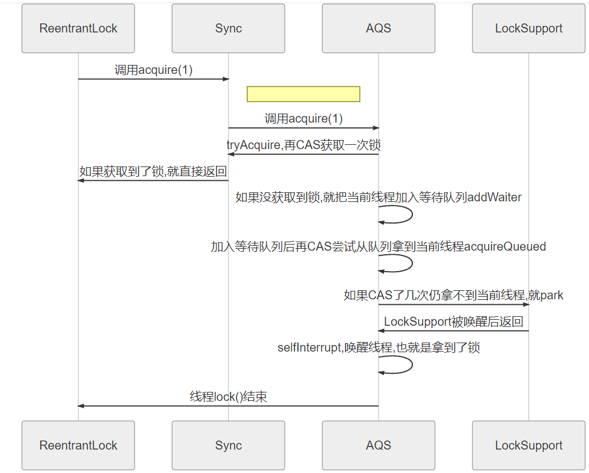
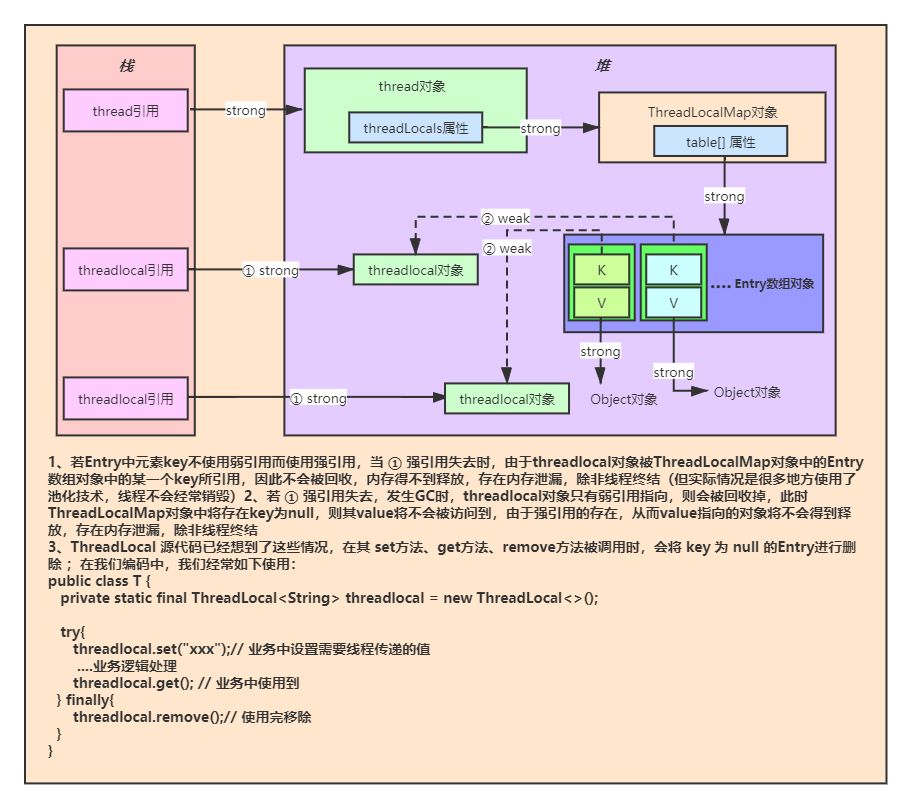
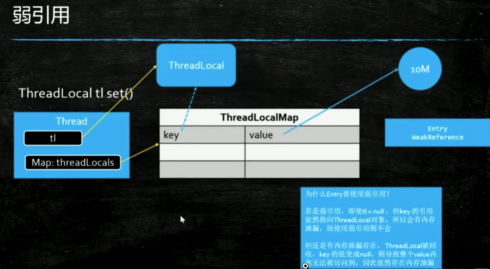

## 进程、线程、纤程---（锁分类）
### 一、进程和线程的区别
    1.进程之间共享信息可以通过tcp/ip协议，线程间共享信息可以通过公用内存
    2.进程是OS分配资源的基本单位，线程是执行调度的基本单位
    3.进程是抢占处理器的调度单位，线程属于某个进程，共享其资源
    4.进程是程序的多个顺序的流动态执行
    5.线程没有自己独立的地址空间，多进程的程序比多线程的程序健壮
    6.进程的切换比线程的切换开销大
    
    纤程：用户态的线程，线程中的线程，切换和调度不需要经过OS
    优势：1：占用的资源很少·2.切换比较简单3.可以启动很多个10w+
    
### 二、Java进程和线程的关系    
    
    1.Java对操作系统提供的功能进行封装，包括进程和线程
    2.运行一个程序会产生一个进程，进程包含至少一个线程
    3.每个进程对应一个JVM实例，多个线程共享JVM里的堆
    4.Java采用单线程编程模型，程序会自动创建主线程
    5.主线程可以创建子线程，原则上要后于子线程完成执行
    
    
### 三、多线程的三种创建方式
    在JAVA中创建一个线程:
    如果调用T1的run()方法,那就是简单的方法调用,代码还是在main线程中从上到下依次执行;
    如果调用T1的start()方法,则会开启一个新的线程(记为thread1)执行,那么thread1和main线程同时执行,表现为控制台"T1"和"main"交替输出
   ```java
public class T01_WhatIsThread {
    private static class T1 extends Thread {
        @Override
        public void run() {
           for(int i=0; i<10; i++) {
               try {
                   TimeUnit.MICROSECONDS.sleep(1);
               } catch (InterruptedException e) {
                   e.printStackTrace();
               }
               System.out.println("T1");
           }
        }
    }

    public static void main(String[] args) {
        //new T1().run();
        new T1().start();
        for(int i=0; i<10; i++) {
            try {
                TimeUnit.MICROSECONDS.sleep(1);
            } catch (InterruptedException e) {
                e.printStackTrace();
            }
            System.out.println("main");
        }

    }
}
```
   2：Thread 2: Runnable 3:Executors.newCachedThrad （lamda 表达式）
   ```java
public class T02_HowToCreateThread {
    static class MyThread extends Thread {
        @Override
        public void run() {
            System.out.println("Hello MyThread!");
        }
    }

    static class MyRun implements Runnable {
        @Override
        public void run() {
            System.out.println("Hello MyRun!");
        }
    }

    public static void main(String[] args) {
        // 第一种,对象继承Thread,然后直接new该对象
        new MyThread().start();
        // 第二种,对象实现Runnable,该对象作为参数创建一个Thread对象
        new Thread(new MyRun()).start();
        // 第二种的变式,其实是匿名内部类的实例作为实现Runnable的对象,又加了lambda表达式简化代码
        new Thread(()->{
            System.out.println("Hello Lambda!");
        }).start();
        // 第三种线程池Executors.newCachedThrad等,其实最终实现也是前两种之一
    }
}
```

### 四、线程的常见操作
    前言
    CPU只管执行命令,对于CPU来说,没有线程的概念,它只是不断的从内存中去拿取指令去执行.
    多线程呢,就是有好多个线程竞争着去给CPU发送命令,每个线程上的命令在CPU上执行一小会,多个线程的命令快速交替执行,这样看起来像是同时执行的.
    各个线程和CPU之间,相当于有一个"等待队列",线程们在队列中排队,等着CPU从队列中随机找一个线程去执行;CPU执行某个线程的一小段命令后,不等执行完,就把它扔回等待队列,然后重新找一个线程执行,这样快速的切换感觉像是多个线程同时执行.如果线程执行完了,那就终结了自己的一生,不会再进入等待队列了.
    线程操作:
    sleep(long millis):当前线程休息一定毫秒数,把执行命令的机会让给其他线程,睡够一定时间后进入等待队列,继续竞争CPU的执行机会
    yield():当前线程正在CPU上运行时,先退出一下,进去线程等待队列,然后大家再一起公平竞争CPU的执行机会.这个几乎用不到.
    join():假设俩个线程t1,t2,在t1中调用t2.join(),则此时执行t2的命令,t2执行完后t1继续执行,用于保证线程的执行顺序
    stop(): 在工程中尽量不要用,容易出现状态不一致问题,略复杂,就当没有这个方法吧
    interrupt():interrupt后会抛出一个异常,需要在上层catch改异常,然后做一些逻辑处理,控制程序流程.业务逻辑中也几乎没有必须interrupt的,也尽量不要用.
    假想的一个interrupt的场景:线程t1调用了sleep(两天)的方法,但是在一天后,需要让它醒来,那就调用t1.interrupt();前提是t1sleep时做好被interrupt的准备,即catchinterrupted异常,然后继续执行或者干点别的事.
   
### 五、线程的常见状态
    线程状态迁移图:
    线程在"等待队列"中等着被CPU执行时,就是Ready状态;线程正在被CPU执行时,是Running状态;Ready和Running合称为Runnable状态.
    线程执行完后(或者被操作系统kill掉),进入terminated状态,结束了自己的一生,啥都不能干了(等待被GC回收).
   
    
    获取线程状态的方法:new MyThead().getState();
    
### 六、Java常见锁
   
   
   
## synchronized 关键字  
    synchronized 关键字(常见问题)
    多个线程去访问同一个资源的时候,需要上锁,目的是保证状态的一致,就像数据库的事务一样.
    类比场景:多个同学去厕所蹲坑.
    
    锁的是什么?
    是一个对象(包括class对象),拿到锁之后才能去执行某段代码.而不是锁的代码.
    注意不要用String常量和Integer等基础数据类型作为锁的对象
    不能用String的原因:所有的字符串常量都是同一个对象,假如引用的依赖包中用了String常量作为锁的对象,自己的程序也刚好用了相同String常量作为锁的对象,那么肯定会引起奇怪的问题.
    也尽量不用String对象.
    不能用Integer等基础数据类型的原因:Integer内部做了一些特殊处理,Integer的对象的值一旦改变,就会变成一个新对象 
   ```java
public class T {
	
	private int count = 10;
	private Object o = new Object();
	
	public void s() {
		synchronized(o) { //任何线程要执行线面的代码,必须先拿到对象o的锁
			count--;
			System.out.println(Thread.currentThread().getName() + " count = " + count);
		}
	}
	
}
```

### 一、synchronize底层怎么实现?什么是锁升级?synchronize一定比原子类慢?
    JVM规范中没有任何要求,只要能保证功能完整就行.
    HotSpot是这样的:对象头(64位)中,拿出2位来记录这个对象是不是被锁定了,mark word.
    
    synchronize修饰的对象，编译之后，class文件中会加上monitorenter和monitorexit来实现的
    
    JDK早期,synchronize是重量级的,每次都去找操作系统申请锁,效率很低;
    后来改进了,引入了锁升级(可以看没错，我就是厕所所长一文)
      1、偏向锁:当第一个线程去执行带synchronize方法时,先在对象头的markword上记录这个线程的线程号,不加锁;如果下次又是该线程执行那个方法,就直接访问不需获取锁.(偏向第一个线程)
      2、自旋锁:如果有线程争用,则升级为自旋锁,比如线程t1正在访问带锁资源r,这时t2也要访问r,那么t2先不加锁,while(true)空执行一会,看t1是不是会马上释放锁.默认自旋10次,如果10后还得不到锁,则升级为重量级锁
      3、重量级锁:去操作系统申请资源加锁
      
    Hotspot目前的实现,锁只能升级,不能降级.
    所以现在的synchronize并不一定比那些原子类慢,因为有锁升级
    自旋锁占用CPU,但是不去跟操作系统申请资源加锁,只是在用户态,不经过内核态.
    当加锁方法执行时间很长,或者线程数很多时,用操作系统锁比较好;
    当执行时间很短,且线程不太多时,用自旋锁合适.
    
    synchronize的特点：
    可以在方法上加synchronize关键字,锁定当前对象(非静态方法),或者当前类的class对象(静态方法)
    synchronize(this)锁定当前对象;
    对于非静态方法,synchronize(this)如果锁住了方法中的所有代码,那就和直接在方法上加synchronize是一样的;对于静态方法,方法上的synchronize相当于synchronize(T.class)
    (每一个.class文件,load到内存以后,会生成一个对应的Class对象)
    
    synchronize既保证可见性,又保证原子性
    
    可重入.假如两个方法m1,m2都对同一个对象加了锁;如果m1中调用了m2,是可以再次获得锁的.(如果不允许重入,那就死锁了).可重入的概念是在同一个线程的基础上的.
    重入锁实现可重入性原理或机制是：每一个锁关联一个线程持有者和计数器，当计数器为 0 时表示该锁没有被任何线程持有，那么任何线程都可能获得该锁而调用相应的方法；当某一线程请求成功后，JVM会记下锁的持有线程，并且将计数器置为 1；此时其它线程请求该锁，则必须等待；而该持有锁的线程如果再次请求这个锁，就可以再次拿到这个锁，同时计数器会递增；当线程退出同步代码块时，计数器会递减，如果计数器为 0，则释放该锁。
    
    class对象是单例的吗?
    同一个ClassLoader内是单例的;多个ClassLoader间,不是单例;但是不同加载器之间不能互相访问.所以,可以认为是单例.
    
   父类中有一个synchronize方法,在子类中调用,那么锁的是谁?
   是子类对象,打印一下this即可证明:
   ```java
public class T {
	synchronized void s() {
		System.out.println("super s start");
		System.out.println(this);
		try {
			TimeUnit.SECONDS.sleep(1);
		} catch (InterruptedException e) {
			e.printStackTrace();
		}
		System.out.println("super s end");
	}
	
	public static void main(String[] args) {
		new TT().s();
		System.out.println("---");
		new TT().m2();
		System.out.println("---");
		new TT().m3();
	}
	
}

class TT extends T {
	@Override
	synchronized void s() {
		System.out.println("child s start");
		System.out.println(this);
		super.s();
		System.out.println("child s end");
	}

	synchronized void m2() {
		System.out.println("child m2 start");
		System.out.println(this);
		super.s();
		System.out.println("child m2 end");
	}

	void m3() {
		System.out.println("child m2 start");
		System.out.println(this);
		super.s();
		System.out.println("child m2 end");
	}
}
```
   带锁的方法和不带锁的方法可以同时执行吗?
   
     可以
   
   程序中如果抛出了异常,锁会被释放吗?
   
   
     抛出异常会释放锁,所以一定要处理好异常,防止出现异常后被其他线程访问资源,从而导致各种状态不一致的问题
   
   锁优化
   
     锁细化:锁住(synchronize包括)的代码,在能保证业务逻辑OK下,越少越好.
     锁粗化:假如一段业务逻辑,中间有很多个细化的小锁,这些小锁的方法别的业务又不会调用,那就把这些小锁合并成一个大锁.
     
   锁的属性(field)发生变化,会影响锁的使用效果吗?
   
     锁的属性变化不会影响锁的功能;
     但是如果锁的变量(或者说"引用")指向了别的对象,那就不是同一把锁了,会出问题.可以通过给变量加上final关键字避免这个问题
     
 
 
## Volatile关键字
    volatile
    首先,大佬(马老师)说,这个volatile在工程中能不用就不用,因为这玩意不好掌控,没有什么资料
    
### 一、保证线程可见性(synchronize也有这效果
    设一个变量a,如果没有加volatile,多线程情况下,在线程t1修改了a的值后,另一个线程t2读到的仍然是旧值;如果加了volatile修饰,t2就可以马上读到t1修改后的值.
    因为如下:(本质依靠的是MESI,CPU的缓存一致性协议)
    首先变量a保存在heap堆内存中,堆内存是各线程共享内存;而且每个线程都有自己的专属工作内存.
    
    当两个线程,t1和t2去访问共享内存的变量a时,他们会各自把a复制一份到自己的专属内存.
    如果变量a没有加volatile,这时候如果线程t1修改了变量的值,(t1应该会把变动马上同步回共享内存),但是线程t2什么时候去共享内存再次读取同步变量a,不好控制,如果线程2没有去共享内存再次读取同步变量a,那么就看不见线程1的修改后的结果.
    看一个保证线程可见性的例子:
    在一秒后,main线程修改了变量running的值,
    没有加volatile时,程序会过很久才打印"s end!";
    加了volatile后,会在一秒后马上打印"s end!"
   ```java
import java.util.concurrent.TimeUnit;

public class T01_HelloVolatile {
    // 对比一下有无volatile的运行结果
	/*volatile*/ boolean running = true;
	void s() {
		System.out.println("s start");
		while(running) {
		}
		System.out.println("s end!");
	}
	
	public static void main(String[] args) {
		T01_HelloVolatile t = new T01_HelloVolatile();
		
		new Thread(t::s, "t1").start();

		try {
			TimeUnit.SECONDS.sleep(1);
		} catch (InterruptedException e) {
			e.printStackTrace();
		}
		
		t.running = false;
	}
	
}
```

### 二、禁止指令重排序(也和CPU有关)(synchronize无此效果)
    (其底层原理是加了读屏障loadfence和写屏障storefence原语指令)
    以前的CPU是"串联"执行指令;现代CPU为了提高效率,当第一个指令执行到中间时,就开始执行第二个指令.(原来像是平铺的水泥板,现在像是楼梯).
    为了利用CPU的这种高效架构,编译器(compiler)把源码编译时,可能会将指令重新排序,据说这样会把速度提高很多.
    指令重排序可能带来问题的场景举例:DCL单例模式
    
    DCL双重检查锁实现的单例模式(静态实例变量加volatile)
    
    new一个对象的时候,分为三步:
     1、给这个对象申请内存,给成员变量赋默认值(比如int的默认值为0);
     2、给这个对象的成员变量初始化(比如我们写的int a=8)
     3、把申请的内存赋值给对象的"引用"
    正常情况下是1,2,3顺序执行;如果发生指令重排序的话,会1,3,2这样顺序执行.
    重排序后,在特别大的并发量下,可能会在第1,3步后,还没有执行第2步前,这时该引用已经!=null了,但是成员变量还没有初始化,这个时候对象被其他线程使用就会出问题.
    DCL单例模式举例:(这个属于懒汉模式,一般用不到;直接用恶汉单例就行啦,没必要用懒汉)
   ```java
public class Manager {
    private static volatile Manager INSTANCE = null;

	// 私有构造方法
    private Manager() {

    }

    public static Manager getInstance() {
        if (INSTANCE == null) {
            synchronized (Manager.class) {
                if (INSTANCE == null) {
                    // 初始化INSTANCE,加载所需资源等
                    INSTANCE = new Manager();
                }
            }
        }
        return INSTANCE;
    }
}
```

### 三、不能保证原子性
    做个测试证明一下,如果volatile可以保证原子性,那么下面这段代码应该输出100000;反之则证明volatile不能保证原子性.
    如果想保证原子性,可以在方法m()上加个synchronize,或者把count++这段代码用synchronize包起来.
   ```java
public class T04_VolatileNotSync {
	volatile int count = 0;
	void s() {
		for(int i=0; i<10000; i++) {
		  count++;
		  /*
		  synchronize(this){
		    count++;
		  }
		  */
		}
	}
	
	public static void main(String[] args) {
		T04_VolatileNotSync t = new T04_VolatileNotSync();
		List<Thread> threads = new ArrayList<Thread>();
		for(int i=0; i<10; i++) {
			threads.add(new Thread(t::s, "thread-"+i));
		}
		threads.forEach((o)->o.start());
		threads.forEach((o)->{
			try {
				o.join();
			} catch (InterruptedException e) {
				e.printStackTrace();
			}
		});
		System.out.println(t.count);
	}
}
```

### 四、volatile修饰引用类型变量的可见性?
    有些文章会写到,volatile如果修饰引用类型变量,那么"引用"的地址的改变对其他线程是可见的,但是引用的对象的属性变化对其他线程不可见.
    
    如果你写一个例子,经过一些尝试,发现普通对象的属性的改变,volatile能保证其变化是可见的.但是!!!
    但是!!!大量的测试后,我发现,不是每次都可见,特别是对象的属性变化很多次的时候!
    所以,结论是,volatile的确不能保证变量指向的对象的属性的可见性.
    又但是!如果修改对象属性的线程,sleep了一下,哪怕一纳秒,那么就能保证可见了,真是奇怪,回头有时间研究下JVM没准能搞明白.(也有可能是sleep的情况下,测试次数不够多)
    
    下面是测试的例子,可以看出,volatile修饰的引用类型变量,如果修改的线程(生产者)没有sleep,其他线程不是每次都可见.
   ```java
public class VolatileObject {
    volatile static Pet pet = new Pet("dahuang", 1);

    public static void main(String[] args) {
        // 多运行几次无论是ageChange还是nameChange,会发现有时候t1不会结束(如果t2不sleep)
        nameChange();
//        ageChange();
    }

    private static void ageChange() {
        new Thread(() -> {
            System.out.println("t1 start "/* + Instant.now()*/);
            while (true) {
                if (pet.getAge() == 5) {
                    break;
                }
            }
            System.out.println("t1 end "/* + Instant.now()*/);
        }, "t1").start();
        try {
            TimeUnit.SECONDS.sleep(1);
        } catch (InterruptedException e) {
            e.printStackTrace();
        }
        new Thread(() -> {
            Pet myPet = pet;
            for (int i = 1; i <= 100; i++) {
                int age = myPet.getAge();
                myPet.setAge(++age);
                /*try {
                    Thread.sleep(1);
                } catch (InterruptedException e) {
                    e.printStackTrace();
                }*/
            }
            System.out.println("t2 end "/* + Instant.now()*/);
        }, "t2").start();
    }

    private static void nameChange() {
        new Thread(() -> {
            System.out.println("t1 start "/* + Instant.now()*/);
            while (true) {
                if ("xiaobai8".equals(pet.getName())) {
                    break;
                }
            }
            System.out.println("t1 end "/* + Instant.now()*/);
        }, "t1").start();
        try {
            TimeUnit.SECONDS.sleep(1);
        } catch (InterruptedException e) {
            e.printStackTrace();
        }
        new Thread(() -> {
            Pet myPet = pet;
            for (int i = 1; i <= 10; i++) {
                myPet.setName("xiaobai" + i);
                /*try {
                    TimeUnit.NANOSECONDS.sleep(1);
                } catch (InterruptedException e) {
                    e.printStackTrace();
                }*/
            }
            System.out.println("t2 end "/* + Instant.now()*/);
        }, "t2").start();
    }

    static class Pet {
        String name;

        int age;

        public Pet(String name, int age) {
            this.name = name;
            this.age = age;
        }

        public String getName() {
            return name;
        }

        public void setName(String name) {
            this.name = name;
        }

        public int getAge() {
            return age;
        }

        public void setAge(int age) {
            this.age = age;
        }
    }
}
```


## CAS(无锁优化、自旋锁、乐观锁)
    首先要明确一点,自旋而"无锁"并不一定就比有锁快,因为自旋是在占用CPU,如果很多个线程一起自旋很久,想想都觉得效率很低…具体情况还是要具体分析.

   1、概念 Compare And Swap/Set
     
   下面是一段说明CAS原理的伪代码:
   ```java
/**
 * nowValue:当前值,这个值是随时可能被修改的
 * expectedValue:期望值,在调用casMethod前获取到的nowValue
 * newValue:想要修改的新的值
 */
casMethod(nowValue, expectedValue, newValue){
  // 如果当前值和期望值相等,说明本次修改期间没有其他线程修改,则赋值
  if(nowValue == expectedValue) {
    // 问题:此时,已经判定为其他线程没有修改,那么在赋值前会不会被其他线程修改了?
    // 答:不会,cas操作是CPU原语支持,是CPU指令指令级别上的支持,中间不能被打断
    nowValue = newValue;
  } else {
    // 如果当前值和期望值不等,说明本次修改期间有其他线程已经修改了值,
    // 那么就再试一次或者直接返回修改失败的结果
    // todo try again or return fail
}
```

   2、应用:AtomicInteger等atomic类
   
   简单使用：下面这段代码,用了AtomicInteger后,自增部分(count++)不需要加同步锁,输出结果为100000
   ```java
public class T01_AtomicInteger {
	/*volatile*/ //int count1 = 0;
	
	AtomicInteger count = new AtomicInteger(0); 

	/*synchronized*/ void s() { 
		for (int i = 0; i < 10000; i++){
			//if count1.get() < 1000
			count.incrementAndGet(); //count1++
		}
	}

	public static void main(String[] args) {
		T01_AtomicInteger t = new T01_AtomicInteger();
		List<Thread> threads = new ArrayList<Thread>();
		for (int i = 0; i < 10; i++) {
			threads.add(new Thread(t::s, "thread-" + i));
		}
		threads.forEach((o) -> o.start());
		threads.forEach((o) -> {
			try {
				o.join();
			} catch (InterruptedException e) {
				e.printStackTrace();
			}
		});
		System.out.println(t.count);
	}
}
```
   3、简单的分析一波incrementAndGet()
   
   跟踪下去,count.incrementAndGet():
   ```java
/**
     * Atomically increments by one the current value.
     *
     * @return the updated value
     */
    public final int incrementAndGet() {
        return unsafe.getAndAddInt(this, valueOffset, 1) + 1;
    }
```
   继续跟踪,到了Unsafe.class,这里compareAndSwapInt就是用到了CAS:
   ```java
	public final int getAndAddInt(Object var1, long var2, int var4) {
        int var5;
        do {
            var5 = this.getIntVolatile(var1, var2);
        } while(!this.compareAndSwapInt(var1, var2, var5, var5 + var4));

        return var5;
    }
```
   Unsafe.class比较复杂,直接操作JVM中的内存,类似C和C++的操作,比如分配一个对象不用new,而是直接写在内存中;操作对象的属性也可以根据"地址"(or指针)和偏移量定位.
   
  4、ABA问题
  
    什么是ABA?
    在开始使用CAS修改一个值后,在CAS中判断nowValue == expectedValue前,假设有一个线程先把nowValue改成了其他值x,然后又把x改回了nowValue,那么这时候虽然nowValue等于expectedValue,但这个值其实已经被修改过了.
    
    ABA会带来什么问题?
    如果是AtomicInteger等数值类型,其实ABA是没有影响的,无所谓.
    如果是一个对象引用,多数情况是不允许ABA情况的(比如小黄和其女朋友小白要结婚了,但是突然来了小黑抢走了小白,他们成为恋人,过了段时间又把小白还了回来,这婚多半就结不成了).
    
    怎么避免ABA?
    加上版本号version,做任何操作时都把version+1,同时比较nowValue和version
    假设nowValue值为A,version为1,如果有ABA情况发生,即nowValue值变为B后又变回A,那么此时version是3,就可以根据version知道值已经被修改过了.
    例如java.util.concurrent.atomic.AtomicStampedReference

  5、Atomic的常见问题
  
    高并发实现递增的三种方式?
     1、同步static long count2 = 0L;
        synchronized (lock) {
            count2++;
        }
     
     2、CAS原子操作AtomicLong count1 = new AtomicLong(0L);
        count1.incrementAndGet();
     
     3、分段锁LongAdder count3 = new LongAdder();
        count3.increment();
    
    下面代码是一个简单的测试(1000个线程,累加10W次),从中可以LongAdder最快,AtomicLong次之,synchronize最慢.
    synchronize慢是因为会升级成重量级锁,向OS申请资源加锁.
    
    注意:如果线程数较少,或者累加次数较少,LongAdder比AtomicLong慢.所以实际项目中,还是要看项目中的并发度如何. 
   ```java
public class T02_AtomicVsSyncVsLongAdder {
    static long count2 = 0L;
    static AtomicLong count1 = new AtomicLong(0L);
    static LongAdder count3 = new LongAdder();

    public static void main(String[] args) throws Exception {
        Thread[] threads = new Thread[1000];
        for (int i = 0; i < threads.length; i++) {
            threads[i] = new Thread(() -> {
                for (int k = 0; k < 100000; k++) {
                    count1.incrementAndGet();
                }
            });
        }
        long start = System.currentTimeMillis();
        for (Thread t : threads) {
            t.start();
        }
        for (Thread t : threads) {
            t.join();
        }
        long end = System.currentTimeMillis();
        //TimeUnit.SECONDS.sleep(10);
        System.out.println("Atomic: " + count1.get() + " time " + (end - start));
        //-----------------------------------------------------------
        Object lock = new Object();
        for (int i = 0; i < threads.length; i++) {
            threads[i] =
                    new Thread(new Runnable() {
                        @Override
                        public void run() {
                            for (int k = 0; k < 100000; k++) {
                                synchronized (lock) {
                                    count2++;
                                }
                            }
                        }
                    });
        }

        start = System.currentTimeMillis();
        for (Thread t : threads) {
            t.start();
        }
        for (Thread t : threads) {
            t.join();
        }
        end = System.currentTimeMillis();

        System.out.println("Sync: " + count2 + " time " + (end - start));

        //----------------------------------
        for (int i = 0; i < threads.length; i++) {
            threads[i] =
                    new Thread(() -> {
                        for (int k = 0; k < 100000; k++) {
                            count3.increment();
                        }
                    });
        }
        start = System.currentTimeMillis();
        for (Thread t : threads) {
            t.start();
        }
        for (Thread t : threads) {
            t.join();
        }
        end = System.currentTimeMillis();
        //TimeUnit.SECONDS.sleep(10);
        System.out.println("LongAdder: " + count1.longValue() + " time " + (end - start));
    }
    
}
```  
   6、为什么高并发下,LongAdder比AtomicLong快?
   
    LongAdder内部实现类似"分段锁"(分段锁也是CAS操作),把值放在数组里,每个元素作为一个相对独立的部分,分散开线程的压力,最后再汇总起来.(有点类似于MapReduce思想)
    
    
## ReentrantLock,ReadWriteLock,CountdownLatch,CyclicBarrier,Phaser,Semaphore,Exchanger

### 一、各种锁的作用 
    
    如果用了很多锁后,担心死锁逻辑,可以用命令jps、jstack检查，可视化工具 jconsole、jvisualvm、jmc
    
    ReentrantLock和Synchronized相比,最大的特点就是可以根据业务需求灵活控制.
    ReentrantReadWriteLock用于一块资源读多写少,又要求避免脏数据的情况
    Semaphore用于限流,控制最多同时执行的线程数.
    剩下的主要是面试时候吊打面试官(手动狗头):
    CountdownLatch和CyclicBarrier类似,需要准备大批量的数据/资源调动,分多个线程去准备,但是等这些数据都准备OK后才能进行下一步动作.(MapReduce?)
    CountdownLatch是数到0就完事了,再往下数啥效果都没有,不能循环使用;
    CyclicBarrier可以循环使用.
    Exchanger可能写游戏的两人交易时用到
    Phaser可能在遗传算法时用到   
    
### 二、ReentrantLock(重要)

    什么是可重入锁?字面意思, 可重入锁就是对同样的一把锁可以再锁一次.当一个线程中执行到加锁代码时,发现当前持有这把锁的线程就是自己,那可以执行该代码.
    (ReentrantLock内部使用了CAS,有没有使用系统级别锁呢?回头再探究)
    
### 三、ReentrantLock特点|使用场景

    1.简单使用,替代synchronized
    2.可以tryLock(一定时间)
    3.可以被马上打断lockInterruptibly
    4.可以使用公平锁
    
### 四、简单使用,替代synchronized

    这个可以替代synchronized,只是需要手动上锁(lock)和解锁(unlock),要注意lock操作以及接下来的业务代码用try{}包起来,在finally{}中unlock,无论是否有异常,都会释放锁.
    使用synchronized时,当加锁代码执行完或者抛异常时,JVM会自动释放锁.
   ```java
public class T02_ReentrantLock2 {
	Lock lock = new ReentrantLock();
	void m1() {
		try {
			lock.lock(); //synchronized(this)
			for (int i = 0; i < 10; i++) {
				TimeUnit.SECONDS.sleep(1);
				System.out.println(i);
				// 此处验证一下"可重入"特性
				if (i == 2) {
					m2();
				}
			}
		} catch (InterruptedException e) {
			e.printStackTrace();
		} finally {
			lock.unlock();
		}
	}
	void m2() {
		try {
			lock.lock();
			System.out.println("m2 ...");
		} finally {
			lock.unlock();
		}
	}
	public static void main(String[] args) {
		T02_ReentrantLock2 rl = new T02_ReentrantLock2();
		new Thread(rl::m1).start();
		try {
			TimeUnit.SECONDS.sleep(1);
		} catch (InterruptedException e) {
			e.printStackTrace();
		}
		// 必须等锁被上一个线程释放后,才能继续执行
		new Thread(rl::m2).start();
	}
}
```

### 五、可以有不同的condition

    每一个condition可以理解为一个等待队列.
    synchronized中,线程wait后,其实是进了一个等待队列,等待被唤醒;当调用notify时随机唤醒等待队列其中一个线程,当调用notifyall时,唤醒等等待线程中的所有线程.
    synchronized只有一个默认的等待对了,而ReentrantLock可以有多个等待队列,即多个condition
    
   1、看一个生产者/消费者的例子:
   ```java
/**
 * 写一个固定容量同步容器，拥有put和get方法,以及getCount方法,
 * 能够支持2个生产者线程以及10个消费者线程的阻塞调用
 */
public class WzContainerReentrantLock<T> {

    private int max = 10;
    private int size = 0;
    private LinkedList<T> values = new LinkedList<>();
    private Lock lock = new ReentrantLock();
    private Condition producerCondition = lock.newCondition();
    private Condition consumerCondition = lock.newCondition();

    public T get() {
        T t = null;
        try {
            lock.lock();
            while (size == 0) {
                consumerCondition.await();
            }
            t = values.removeFirst();
            size--;
            producerCondition.signalAll();// 通知生产者

        } catch (InterruptedException e) {
            e.printStackTrace();
        } finally {
            lock.unlock();
        }
        return t;
    }

    public void put(T t) {
        try {
            lock.lock();
            while (size == this.max) {
                producerCondition.await();
            }
            values.addLast(t);
            size++;
            consumerCondition.signalAll();// 通知消费者
        } catch (InterruptedException e) {
            e.printStackTrace();
        } finally {
            lock.unlock();
        }
    }

    public static void main(String[] args) {
        WzContainerReentrantLock<String> container = new WzContainerReentrantLock<>();
        //启动消费者线程
        for (int i = 0; i < 10; i++) {
            new Thread(() -> {
                for (int j = 0; j < 4; j++) {
                    String s = container.get();
                    System.out.println(s);
                }
            }, "consumer-" + i).start();
        }

        try {
            TimeUnit.SECONDS.sleep(2);
        } catch (InterruptedException e) {
            e.printStackTrace();
        }

        //启动生产者线程
        for (int i = 0; i < 2; i++) {
            new Thread(() -> {
                for (int j = 0; j < 20; j++) {
                    container.put(Thread.currentThread().getName() + " at " + Instant.now());
                }
            }, "producer-" + i).start();
        }
    }
}
```
   2、可以tryLock(一定时间)
   ```java
public class T03_ReentrantLock3 {
	Lock lock = new ReentrantLock();

	void m1() {
		try {
			lock.lock();
			for (int i = 0; i < 10; i++) {
				TimeUnit.SECONDS.sleep(1);
				System.out.println(i);
			}
		} catch (InterruptedException e) {
			e.printStackTrace();
		} finally {
			lock.unlock();
		}
	}

	/**
	 * 使用tryLock进行尝试锁定，不管锁定与否，方法都将继续执行
	 * 可以根据tryLock的返回值来判定是否锁定
	 * 也可以指定tryLock的时间，由于tryLock(time)抛出异常，所以要注意unclock的处理，必须放到finally中
	 */
	void m2() {
		// 当然也可以lock.tryLock(),不指定时间
		/*
		boolean locked = lock.tryLock();
		System.out.println("m2 ..." + locked);
		if(locked) lock.unlock();
		*/
		boolean locked = false;
		try {
            long start = System.currentTimeMillis();
            locked = lock.tryLock(5, TimeUnit.SECONDS);
            long end = System.currentTimeMillis();
			System.out.println("m2 ..." + locked + "|waiting time:" + (end - start));
		} catch (InterruptedException e) {
			e.printStackTrace();
		} finally {
			if(locked) {
			    lock.unlock();
            }
		}
	}
	public static void main(String[] args) {
		T03_ReentrantLock3 rl = new T03_ReentrantLock3();
		new Thread(rl::m1).start();
		try {
			TimeUnit.SECONDS.sleep(1);
		} catch (InterruptedException e) {
			e.printStackTrace();
		}
		new Thread(rl::m2).start();
	}
}
```
   3、可以被马上打断lockInterruptibly
   
   lock()方法的锁,只能在当前线程获取到锁后才能被打断;
   而lockInterruptibly()可以马上被打断,不必等获取锁.
   
   证明一下:
   ```java
public class T04_ReentrantLock4 {
		
	public static void main(String[] args) {
		Lock lock = new ReentrantLock();
		
		
		Thread t1 = new Thread(()->{
			try {
				lock.lock();
				System.out.println("t1 start");
				TimeUnit.SECONDS.sleep(10);
				System.out.println("t1 end");
			} catch (InterruptedException e) {
				System.out.println("t1 was interrupted!");
			} finally {
				lock.unlock();
			}
		});
		t1.start();
		
		Thread t2 = new Thread(()->{
			try {
				// 如果是直接lock的话,t2就不能被直接打断,只能等t1执行完了,t2获取到lock后才能被打断
//				lock.lock();
				lock.lockInterruptibly(); //可以对interrupt()方法做出响应
				System.out.println("t2 start");
				TimeUnit.SECONDS.sleep(5);
				System.out.println("t2 end");
			} catch (InterruptedException e) {
				System.out.println("t2 was interrupted!");
			} finally {
				lock.unlock();
			}
		});
		t2.start();
		
		try {
			TimeUnit.SECONDS.sleep(1);
		} catch (InterruptedException e) {
			e.printStackTrace();
		}
		t2.interrupt(); //打断线程2的等待
	}
}
```
   4、公平锁
    
    ReentrantLock默认为非公平锁,多个线程在一个队列中去竞争获取锁,随机拿到锁,就跟买彩票一样,不是先买的就先中奖(synchronized也是非公平锁);
    公平锁就是像买饭排队一样,比较"公平".
    
    ReentrantLock可以指定是否为公平锁,默认非公平锁;
    synchronized只有非公平锁
    
    这个不太好写测试用例,回头再证明吧…
    创建ReentrantLock时,传入fair参数为true,创建的就是公平锁
   ```java
public class T05_ReentrantLock5 extends Thread {

    //参数为true表示为公平锁，请对比输出结果
    private static ReentrantLock lock = new ReentrantLock(true);

    @Override
    public void run() {
        for (int i = 0; i < 100; i++) {
            System.out.println(Thread.currentThread().getName() + " will lock at" + System.currentTimeMillis());
            lock.lock();
            try {
                System.out.println(Thread.currentThread().getName() + " get lock at" + System.currentTimeMillis());
            } finally {
                lock.unlock();
            }
        }
    }

    public static void main(String[] args) throws InterruptedException {
        T05_ReentrantLock5 rl = new T05_ReentrantLock5();
        Thread th1 = new Thread(rl);
        Thread th2 = new Thread(rl);
        th1.start();
        th2.start();
    }
}
```

### 六、ReadWriteLock读写锁(重要)

    读写锁是读锁和写锁的合称
    
    读锁:共享锁,其他线程可以同时读,在读操作之间共享资源;但是其他线程不能写,否则会读到脏数据
    写锁:排他锁/互斥锁,其他线程既不能写也不能读,也是为了防止脏数据.
    其他的锁一般都是排它锁/互斥锁,当一个线程拿到锁后,别的线程就只能阻塞等待,啥也干不了
    
    主要用于一些内容,写操作不多,但是读操作很多的地方,比如公司的组织架构
    
   读写锁代码示例:
   ```java
public class T10_TestReadWriteLock {
    static Lock lock = new ReentrantLock();
    private static int value;

    static ReadWriteLock readWriteLock = new ReentrantReadWriteLock();
    static Lock readLock = readWriteLock.readLock();
    static Lock writeLock = readWriteLock.writeLock();

    public static void read(Lock lock, CountDownLatch countDownLatch) {
        try {
            lock.lock();
            //模拟读取操作
            Thread.sleep(1000);
            countDownLatch.countDown();
            System.out.println("read over!");
        } catch (InterruptedException e) {
            e.printStackTrace();
        } finally {
            lock.unlock();
        }
    }

    public static void write(Lock lock, int v, CountDownLatch countDownLatch) {
        try {
            lock.lock();
            // 写操作,模拟耗时1秒
            Thread.sleep(1000);
            value = v;
            countDownLatch.countDown();
            System.out.println("write over!");
        } catch (InterruptedException e) {
            e.printStackTrace();
        } finally {
            lock.unlock();
        }
    }

    public static void main(String[] args) throws InterruptedException {
        // 使用CountDownLatch方便计时,下面有CountdownLatch说明
        CountDownLatch countDownLatch = new CountDownLatch(20);
        // 普通互斥锁
//        Runnable readR = ()-> read(lock, countDownLatch);
//        Runnable writeR = ()->write(lock, new Random().nextInt(), countDownLatch);

        // 读写锁
        Runnable readR = () -> read(readLock, countDownLatch);
        Runnable writeR = () -> write(writeLock, new Random().nextInt(), countDownLatch);


        long start = System.currentTimeMillis();
        for (int i = 0; i < 18; i++) {
            new Thread(readR).start();
        }
        for (int i = 0; i < 2; i++) {
            new Thread(writeR).start();
        }
        countDownLatch.await();
        long end = System.currentTimeMillis();
        System.out.println("cust milliseconds:" + (end - start));

    }
}
```

### 七、Semaphore信号量

    有点类似于令牌桶算法.用于控制并发的最大数量,限流.
    有时候一个任务的某一步骤特别耗时,很多个线程同时执行的话,每个线程都很慢,可能大家都超时失败,为了防止这一现象,可以用信号量控制最大并发数.
    假设希望最大并发数为n,那就创建一个有n个令牌的桶,每次线程执行特定方法时,去申请令牌(acquire),拿不到就阻塞;拿到了才继续执行,执行完再把令牌放回桶里(release).
    
   代码示例:
   ```java
public class T11_TestSemaphore {
    public static void main(String[] args) {
//        Semaphore s = new Semaphore(3);
        Semaphore s = new Semaphore(3, true);
        //允许一个线程同时执行
//        Semaphore s = new Semaphore(1);

        for (int i = 1; i <= 10; i++) {
            new Thread(() -> {
                // 可以做其他的事情,不受信号量控制
                String name = Thread.currentThread().getName();
                try {
                    s.acquire();
                    System.out.println(name + " start...");
                    Thread.sleep(500);
                } catch (InterruptedException e) {
                    e.printStackTrace();
                } finally {
                    s.release();
                    System.out.println(name + " end...");
                }
                // 可以做其他的事情,不受信号量控制
            }).start();
        }
    }
}
```

### 八、CountdownLatch

    见名知意,倒数计数(而非计时)的门闩,计数结束就开门了,然后可以继续执行指令.
    使用场景:用于在一个线程中有些特殊操作,需要在业务逻辑上等待其他几个线程完成特定操作后才能执行.
    
    比线程的join()方法更灵活一些,因为不需要等其他线程全部执行完,而是手动灵活控制.
    做个类比:饭店中的传菜员拿来一页订单,客人要求几个菜一起上,传菜员就要等大厨们都做完装盘后才能把才端给客人;而且大厨炒完菜还要刷锅,这时候传菜员是不需要等待的.

   看一个例子:
   ```java
public class T06_TestCountDownLatch {
    public static void main(String[] args) {
        // 使用线程的join方法
//        usingJoin();
        // 使用门闩
        usingCountDownLatch();
    }

    private static void usingCountDownLatch() {
        Thread[] threads = new Thread[100];
        CountDownLatch latch = new CountDownLatch(threads.length);

        for(int i=0; i<threads.length; i++) {
            threads[i] = new Thread(()->{
                int result = 0;
                // 业务逻辑a,假设本操作是一些操作的前置条件
                for(int j=0; j<10000; j++) {
                    result += j;
                }
                // 门闩倒数计数(减1),原子操作
                latch.countDown();
                // 下面可以有业务逻辑b,c,d无所谓了
                try {
                    TimeUnit.SECONDS.sleep(1);
                    System.out.println(Thread.currentThread().getName() + "at" + new Date());
                } catch (InterruptedException e) {
                    e.printStackTrace();
                }
            });
        }
        for (int i = 0; i < threads.length; i++) {
            threads[i].start();
        }
        try {
            // 插上门闩,等倒数计数完了(到0)才能继续执行
            latch.await();
        } catch (InterruptedException e) {
            e.printStackTrace();
        }

        System.out.println("end latch at" + new Date());
    }

    // 这个作为对比
    private static void usingJoin() {
        Thread[] threads = new Thread[100];
        for(int i=0; i<threads.length; i++) {
            threads[i] = new Thread(()->{
                int result = 0;
                for(int j=0; j<10000; j++) {
                    result += j;
                }
            });
        }
        for (int i = 0; i < threads.length; i++) {
            threads[i].start();
        }

        // 等threads中的线程全都结束后才能继续执行
        for (int i = 0; i < threads.length; i++) {
            try {
                threads[i].join();
            } catch (InterruptedException e) {
                e.printStackTrace();
            }
        }

        System.out.println("end join");
    }
}
```

### 九、CyclicBarrier

    见名知意,循环栅栏.
    就像装鸡蛋的托盘一样,鸡蛋把托盘装满后才去装箱.
    
    首先创建一个CyclicBarrier,它规定当一定数量的线程调用CyclicBarrier的await()方法后,CyclicBarrier会执行一些操作(也可以啥都不做);
    其他线程调用CyclicBarrier的await()方法后,线程开始阻塞,等待barrier满了(各个线程就绪)后才继续执行.
    
    CyclicBarrier的barrierAction由该批次进入的最后一个线程执行
   下面是个例子,可以看出是先Ready后那些线程才能继续执行.
   ```java
public class T07_TestCyclicBarrier {
    public static void main(String[] args) {
        // 线程满了后啥都不做,这个应该用不到
        //CyclicBarrier barrier = new CyclicBarrier(20);
        // lambda表达式,和下面的匿名内部类是等效的
        CyclicBarrier barrier = new CyclicBarrier(20, () -> System.out.println("Ready,go! @ " + Instant.now()));
        /*CyclicBarrier barrier = new CyclicBarrier(20, new Runnable() {
            @Override
            public void run() {
                System.out.println("Ready,go! @ " + Instant.now());
            }
        });*/

        for (int i = 0; i < 100; i++) {

            new Thread(() -> {
                try {
                    TimeUnit.SECONDS.sleep(1);
                    barrier.await();
                    System.out.println(Thread.currentThread().getName() + "GO ON @ " + Instant.now());
                } catch (InterruptedException e) {
                    e.printStackTrace();
                } catch (BrokenBarrierException e) {
                    e.printStackTrace();
                }
            }).start();

        }
    }
}
```

### 十、Phaser(极少用到)

    phase:相位,阶段;phaser就是按照不同的相位阶段去执行不同的命令.
    
    有点像是CountdownLatch和CyclicBarrier的结合:先注册一定的数量parties作为参与的线程数,大家都准备就绪后触发一次onAdvance操作;也可以随时修改这个parties数量.
    触发onAdvance时可以获取到当前是第几个相位(第几次触发),和当前有多少个注册的parties
    
    可以这么理解:CyclicBarrier是只有一个栅栏,Phaser是纵向好几个栅栏,每个栅栏触发时可以有不同的操作.
    
    关键方法:
    0.自定义一个类继承Phaser,并重写onAdvance方法.每次parties到达相位后,会调用onAdvance方法
    1.phaser.bulkRegister(int parties)
    批量注册parties,有点类似于CountdownLatch的倒数计数的初始化
    2.phaser.arriveAndAwaitAdvance()
    Arrives at this phaser and awaits others.
    各parties准备就绪后到达相位,等待其他parties后才继续执行,注意下一次相位仍会参与
    3.phaser.arriveAndDeregister()
    Arrives at this phaser and deregisters from it without waiting for others to arrive.
    到达这个相位,并且从中注销,不需等其他parties到达就可继续执行,不再参与Phaser规则了
    
    应用场景:
    遗传算法(大概是用计算机去模拟达尔文进化策略),这个我没去详细了解.
    以简单的结婚流程为例:
    1.首先关键人物(比如一对新人,伴郎伴娘和亲朋好友等客人)都要到场;2.然后走个结婚的流程,新人发表感言,客人吃饭,新人敬酒;3.客人陆续离场;4.新人入洞房,相互拥抱.
    这些步骤顺序不能乱,行为的执行者也不能乱.(只有在大家离场后,两位新人才能入洞房,哈哈)
    
   代码示例:
   ```java
public class T09_TestPhaserWedding {
    static Random r = new Random();
    static MarriagePhaser phaser = new MarriagePhaser();


    static void milliSleep(int milli) {
        try {
            TimeUnit.MILLISECONDS.sleep(milli);
        } catch (InterruptedException e) {
            e.printStackTrace();
        }
    }

    public static void main(String[] args) {

        phaser.bulkRegister(7);

        // 5位客人
        for(int i=0; i<5; i++) {
            new Thread(new Person("p" + i)).start();
        }
        // 2位新人
        new Thread(new Person("bridegroom")).start();
        new Thread(new Person("bride")).start();

    }

    static class MarriagePhaser extends Phaser {
        /**
         *
         * @param phase 当前是第几个阶段.the current phase number on entry to this method,
         * before this phaser is advanced
         * @param registeredParties 目前多少线程参与.the current number of registered parties
         * @return {@code true} if this phaser should terminate
         */
        @Override
        protected boolean onAdvance(int phase, int registeredParties) {
            switch (phase) {
                case 0:
                    System.out.println("everyone arrived!" + registeredParties);
                    System.out.println();
                    return false;
                case 1:
                    System.out.println("everyone finished eating!" + registeredParties);
                    System.out.println();
                    return false;
                case 2:
                    System.out.println("everyone left!" + registeredParties);
                    System.out.println();
                    return false;
                case 3:
                    System.out.println("The Newlywed Time!" + registeredParties);
                    return true;
                default:
                    return true;
            }
        }
    }


    static class Person implements Runnable {
        String name;

        public Person(String name) {
            this.name = name;
        }

        public void arrive() {
            milliSleep(r.nextInt(1000));
            System.out.printf("%s arrived!\n", name);
            phaser.arriveAndAwaitAdvance();
        }

        public void eat() {
            milliSleep(r.nextInt(1000));
            System.out.printf("%s finish eating!\n", name);
            phaser.arriveAndAwaitAdvance();
        }

        public void leave() {
            milliSleep(r.nextInt(1000));
            System.out.printf("%s leave!\n", name);
            phaser.arriveAndAwaitAdvance();
            // 所有人离去后,保洁人员才打扫座位
            System.out.printf("everyone was left, clean %s's seat\n", name);
        }

        private void hug() {
            if(name.equals("bridegroom") || name.equals("bride")) {
                milliSleep(r.nextInt(1000));
                System.out.printf("%s hug!\n", name);
                phaser.arriveAndAwaitAdvance();
            } else {
                phaser.arriveAndDeregister();
                // 注销后,不必等本次相位的所有parties到达,可以随意执行
                System.out.printf("%s Deregister\n", name);
            }
        }

        @Override
        public void run() {
            arrive();
            eat();
            leave();
            hug();
        }
    }
}
```

### 十一、Exchanger交换器

    用于两个线程间交换数据.
    中间有个类似CyclicBarrier的操作,第一个线程准备好而第二个线程没准备好前,第一个会阻塞;只有两个线程都准备好后才会开始交换,然后继续执行
    
    应用场景:两人做交易(不知道各位有没有玩过零几年很火的游戏<传奇>?)
    
   代码示例:
   ```java
public class T12_TestExchanger {

    static Exchanger<String> exchanger = new Exchanger<>();

    public static void main(String[] args) {
        new Thread(()->{
            String source = "T1";
            String getted = null;
            try {
                TimeUnit.SECONDS.sleep(3);
                System.out.println("T1 ready @" + new Date());
                getted = exchanger.exchange(source);
            } catch (InterruptedException e) {
                e.printStackTrace();
            }
            System.out.println(Thread.currentThread().getName() + " get:" + getted + "@" + new Date());

        }, "t1").start();


        new Thread(()->{
            String source = "T2";
            String getted = null;
            try {
                System.out.println("T2 ready @" + new Date());
                getted = exchanger.exchange(source);
            } catch (InterruptedException e) {
                e.printStackTrace();
            }
            System.out.println(Thread.currentThread().getName() + " get:" + getted + "@" + new Date());

        }, "t2").start();

        // 如果再来个T3,程序会一直阻塞下去
        /*new Thread(()->{
            String source = "T3";
            String getted = null;
            try {
                System.out.println("T3 ready @" + new Date());
                getted = exchanger.exchange(source);
            } catch (InterruptedException e) {
                e.printStackTrace();
            }
            System.out.println(Thread.currentThread().getName() + " get:" + getted + "@" + new Date());

        }, "t3").start();*/
    }
}
```


## AQS
    
### 一、简介
    
    AQS:AbstractQueuedSynchronizer
    JAVA的几乎所有锁(除synchronized,LockSupport外)都是用AQS实现的,比如ReentrantLock,CountdownLatch,CyclicBarrier,Semaphore等;    
    
  1、可以说AQS的底层就是CAS+volatile
   ```java
1. state变量
使用int类型的volatile变量维护同步状态(state)
围绕state提供锁的两种操作“获取”和“释放=0”； 读锁与写锁区分 65535= 2^16-1
FutureTask用它来表示任务的状态
2. 内置的同步队列 CLH，双端双向列表
FIFO队列存放阻塞的等待线程，来完成线程的排队执行；
封装成Node，Node维护一个prev引用和next引用，实现双向链表
AQS维护两个指针，分别指向队列头部head和尾部tail

 
锁是面向使用者的，定义了用户调用的接口，隐藏了实现细节；

AQS是锁的实现者，屏蔽了同步状态管理，线程的排队，等待唤醒的底层操作。

锁是面向使用者，AQS是锁的具体实现者
背后复杂的线程排队，线程阻塞/唤醒，如何保证线程安全，都由AQS为我们完成了
```
   底层是一个双向链表-->cas来维护 ; int常量state volatile修饰
   
   ①. 属性private volatile int state;同步状态
   这个state在不同的子类实现中有不同的含义,但都是通过这个state来控制"同步"的行为.这个state通过CAS来改变.
   
   ②. AQS维护着Node的双向链表作为等待队列,这个等待队列是"CLH"(Craig, Landin, and Hagersten)队列的变体Node是AQS的内部类,Node里面的属性装着线程volatile Thread thread,和一个状态volatile int waitStatus.各个线程去争抢的过程其实就是这个CLH队列的入列和出列,这个过程的关键操作都是通过CAS来实现的
   
  2、通过ReentrantLock的lock()方法,去阅读理解AQS
   
    AbstractQueuedSynchronizer的state属性对于ReentrantLock的意义:
    state表示线程持有锁的次数:
    state=0表示没有线程持有锁;
    state>0表示有一个线程持有锁,重入了state次.
    
    起初我是看的JDK8的源码,但是它和JDK13上有一些细节上的区别,JDK13更好理解一些.我还记下了JDK8和JDK11在AQS实现上的区别,后来想想没啥意义,还容易记忆混乱,就干脆只记录JDK13的实现方式了.既然学习嘛,那就学新的~
    
    JDK8和新版的JDK(以11为例)实现的细节上有些不同,整体思路是一样的:
    CAS修改state和Node节点入队列时,JDK8通过unsafe获取变量的内存地址偏移量,和JDK11通过变量句柄指向变量的地址.
    按我的理解,这俩效果是一样的,JDK11的效率应该更高一些
    
    以state为例:
    JDK8用到了stateOffset.(为了允许将来的优化没有用AtomicInteger),这个stateOffset可以理解为state的"指针"(地址),可以通过stateOffsetCAS改变state。
   ```java
long stateOffset=unsafe.objectFieldOffset(AbstractQueuedSynchronizer.class.getDeclaredField("state"));
unsafe.compareAndSwapInt(this, stateOffset, expect, update);
```
   JDK11用到了VarHandle,可以直接CAS改变state
   ```java
VarHandle STATE=MethodHandles.lookup()
.findVarHandle(AbstractQueuedSynchronizer.class, "state", int.class);
STATE.compareAndSet(this, expect, update)
```
   Unsafe是实现CAS的核心类，Java无法直接访问底层操作系统，而是通过本地（native）方法来访问。Unsafe类提供了硬件级别的原子操作。
   
  3、lock()的大致流程如下:
  
   下面简称AbstractQueuedSynchronizer为AQS,AbstractOwnableSynchronizer为AOS
   
   
  4、尝试阅读ReentrantLock的lock()方法
  
   下面尝试着通过debugReentrantLock.lock()方法,去阅读源码.
   
   ①、首先随便写个方法,在lock.lock()处打断点,然后debug运行,追踪下去
   ```java
	public static void main(String[] args) {
        ReentrantLock lock = new ReentrantLock();
        lock.lock();
        System.out.println("hahaha");
        lock.unlock();
    }
```
   ②、看到ReentrantLock的lock()方法
   
    ReentrantLock.lock()方法注释的大致意思:
    这个方法用于获得该锁;
    如果该锁没有被线程持有,那么把锁的hold count设为1后直接返回;
    如果当前线程已经持有该锁,则hold count加一,然后返回;
    如果该锁被其他线程持有,那么当前线程将"阻塞",直到获得锁,然后把hold count设为1后返回
    这个lock hold count应该就是AQS的state
   ```java
 /**
     * Acquires the lock.
     *
     * <p>Acquires the lock if it is not held by another thread and returns
     * immediately, setting the lock hold count to one.
     *
     * <p>If the current thread already holds the lock then the hold
     * count is incremented by one and the method returns immediately.
     *
     * <p>If the lock is held by another thread then the
     * current thread becomes disabled for thread scheduling
     * purposes and lies dormant until the lock has been acquired,
     * at which time the lock hold count is set to one.
     */
    public void lock() {
        sync.acquire(1);
    }
```
   ③、看到ReentrantLock.lock()其实是调用了sync.acquire(1),sync变量是Sync类型.Sync是何许人也?
       
     Sync,NonfairSync,FairSync都是ReentrantLock的内部类
     Sync 继承了 AbstractQueuedSynchronizer
     NonfairSync(非公平锁的实现) 和 FairSync(公平锁的实现) 都继承了 Sync
     Sync的acquire方法继承自AQS,自己没有实现:
     
   ```java
 /**
     * Acquires in exclusive mode, ignoring interrupts.  Implemented
     * by invoking at least once {@link #tryAcquire},
     * returning on success.  Otherwise the thread is queued, possibly
     * repeatedly blocking and unblocking, invoking {@link
     * #tryAcquire} until success.  This method can be used
     * to implement method {@link Lock#lock}.
     *
     * @param arg the acquire argument.  This value is conveyed to
     *        {@link #tryAcquire} but is otherwise uninterpreted and
     *        can represent anything you like.
     */
    public final void acquire(int arg) {
        if (!tryAcquire(arg) &&
            acquireQueued(addWaiter(Node.EXCLUSIVE), arg))
            selfInterrupt();
    }
```
   ④、AQS的acquire中的tryAcquire是由子类实现的
   
     这个tryAcquire是NonfairSync实现的,调用了Sync的nonfairTryAcquire方法,因为ReentrantLock是默认是非公平锁
     
   下面代码：
   ```java
/**
         * Performs non-fair tryLock.  tryAcquire is implemented in
         * subclasses, but both need nonfair try for trylock method.
         */
        @ReservedStackAccess
        final boolean nonfairTryAcquire(int acquires) {
            final Thread current = Thread.currentThread();
            /*
            getState()调用了AQS的方法,直接返回了state属性.
			如果state等于0,则CAS设置stateOffset为acquires;
			如果state!=0,则判断拥有锁的线程是不是当前线程,如果不是则返回false;如果是当前线程已经持有锁,则更新state值为state+acquire(可重入)
			可见ReentrantLock把state作为是否锁定的判断标准,如果state=0则表示没有线程持有锁.如果state值>0,则表示已有线程持有了锁,并且持有了state次(可重入).
			*/
            int c = getState();
            if (c == 0) {
            	// compareAndSetState是AQS的方法,CAS修改state值
                if (compareAndSetState(0, acquires)) {
                	//AQS继承了AbstractOwnableSynchronizer
                	//设置状态后,则进入AbstractOwnableSynchronizer的setExclusiveOwnerThread方法.表示已经拿到锁.
                    setExclusiveOwnerThread(current);
                    return true;
                }
            }
            // 没拿到锁,则判断是否锁的持有者就是当前线程
            else if (current == getExclusiveOwnerThread()) {
           		// 当前线程重入
                int nextc = c + acquires;
                if (nextc < 0) // overflow
                    throw new Error("Maximum lock count exceeded");
                setState(nextc);
                return true;
            }
            return false;
        }
```
   ⑤、如果tryAcquire没有成功获得锁,则把当前线程加入等待队列
   ```java
 /**
     * Creates and enqueues node for current thread and given mode.
     *
     * @param mode Node.EXCLUSIVE for exclusive, Node.SHARED for shared
     * @return the new node
     */
    private Node addWaiter(Node mode) {
        Node node = new Node(mode);
		// 自旋把前节点加入等待队列
        for (;;) {
            Node oldTail = tail;
            if (oldTail != null) {
                node.setPrevRelaxed(oldTail);
                if (compareAndSetTail(oldTail, node)) {
                    oldTail.next = node;
                    return node;
                }
            } else {
                initializeSyncQueue();
            }
        }
    }
```
   ⑥、然后调用acquireQueued方法
   ```java
   /**
     * Acquires in exclusive uninterruptible mode for thread already in
     * queue. Used by condition wait methods as well as acquire.
     *
     * @param node the node
     * @param arg the acquire argument
     * @return {@code true} if interrupted while waiting
     */
    final boolean acquireQueued(final Node node, int arg) {
        boolean interrupted = false;
        try {
            for (;;) {
                final Node p = node.predecessor();
                // 如果上一个节点是头节点,则说明下一个就该当前线程了
                // 那就试着去拿一下锁,tryAcquire仍是调用的子类(Sync)的方法
                if (p == head && tryAcquire(arg)) {
                    setHead(node);
                    p.next = null; // help GC
                    return interrupted;
                }
                // 判断是否需要park,需要的话就调用LockSupport的park阻塞线程
                if (shouldParkAfterFailedAcquire(p, node))
                    interrupted |= parkAndCheckInterrupt();
            }
        } catch (Throwable t) {
            cancelAcquire(node);
            if (interrupted)
                selfInterrupt();
            throw t;
        }
    }
```


## ThreadLocal与引用（强软弱虚）
  
### 一、 ThreadLocal
    
     假设有一个静态变量,线程使用它的过程中可能会做一些修改,但是这些修改只想在这个线程内部生效,不想影响其他线程,那么就应该用ThreadLocal.
     
   举个栗子
   ```java
public class ThreadLocal2 {
	// 创建一个ThreadLocal变量
	static ThreadLocal<Person> tl = new ThreadLocal<>();
	// 也可以直接初始化赋值
	//static ThreadLocal<Person> tl = ThreadLocal.withInitial(() -> new Person("xiaobai"));
	public static void main(String[] args) {
				
		new Thread(()->{
			try {
				TimeUnit.SECONDS.sleep(2);
			} catch (InterruptedException e) {
				e.printStackTrace();
			}
			// 下面线程的ThreadLocal.set不会影响当前线程
			// 所以从ThreadLocal中取值,是null(对于当前线程来说,还没有set过值)
			System.out.println(tl.get());
		}).start();
		
		new Thread(()->{
			try {
				TimeUnit.SECONDS.sleep(1);
			} catch (InterruptedException e) {
				e.printStackTrace();
			}
			// ThreadLocal放入值
			tl.set(new Person());
			// 处理处理
			// 用完后remove掉
			tl.remove();
		}).start();
	}
	
	static class Person {
		String name = "zhangsan";
	}
}
```

### 二、源码解析

    ThreadLocal.set()过程(get同理)
   
   
    每个线程会维护一个ThreadLocal.ThreadLocalMap类型变量,ThreadLocalMap是hash map的一个定制化实现,这个ThreadLocalMap中的key是一个个的ThreadLocal的"地址",值是各自维护的值.
    
    可以这么理解:
    ThreadLocal.set是把值set到了当前线程维护的一个Map中,key是弱引用,value是强引用.
    
    如果一个方法内部使用一个变量指向ThreadLocal.get(),当方法结束时会回收这个变量的(强)引用,此时这个ThreadLocalMap中的key就只有弱引用指向了,一旦GC就会被回收.但是ThreadLocalMap对应的value还是强引用,如果key被回收了,那这个value就不能被访问也不能被回收了.
    所以我们使用ThreadLocal时,如果用完该value了,就remove掉,避免内存泄漏
   
   
### 三、用途
    
    1、Spring 声明式事务
    2、动态数据源
    3、用户信息线程中传递
    
### 四、强软弱虚引用

   1、强引用
   
    普通的引用如Object obj = new Object()就是一个强引用,只要有变量在指向这个对象,那么它就一定不会被GC回收
   求证小例子
   先写个这个类,为了观察垃圾回收
   ```java
public class M {
	// GC回收该对象时会调用该方法
	// 这个方法在工程中,永远都不建议重写!这里重写是为了更好的观察垃圾回收,当GC回收该对象时,会打印finalize
    @Override
    protected void finalize() throws Throwable {
        System.out.println("finalize");
    }
}
```
   强引用(普通引用)小测试:
   ```java
public class T01_NormalReference {
    public static void main(String[] args) throws IOException {
        M s = new M();
        // 如果m不指向null,就不会打印finalize
        s = null;
        System.gc(); //DisableExplicitGC
		// 为了阻塞当前线程,使程序不立即停止
        System.in.read();
    }
}
```
   2、软引用
   
    SoftReference s = new SoftReference<>(new Object)
    如果一个对象,只被一个软引用指向,那么当JVM内存不够用的时候会回收该对象.
    对于软引用关联着的对象，在系统将要发生内存溢出异常之前，将会把这些对象列进回收范围进行第二次回收。
    如果这次回收还没有足够的内存，才会抛出内存溢出异常。
    
   软引用非常适合缓存使用
   
   求证小例子；这个例子运行时需要将堆内存设置成20M,设置JVM参数: -Xms20M -Xmx20M
   ```java
public class T02_SoftReference {
    public static void main(String[] args) {
    	// 10M的byte数组对象
        SoftReference<byte[]> s = new SoftReference<>(new byte[1024*1024*10]);
        //s = null;
        System.out.println(s.get());
        System.gc();
        try {
            Thread.sleep(500);
        } catch (InterruptedException e) {
            e.printStackTrace();
        }
        System.out.println(s.get());
        //再分配一个数组，heap将装不下，这时候系统会垃圾回收，先回收一次，如果不够，会把软引用干掉
        // 15M的byte数组对象,如果改为5M的数组则m不会被回收
        byte[] b = new byte[1024*1024*15];
        // 如果m被回收了,则输出为null
        System.out.println(s.get());
    }
}
```
   3、弱引用
    
    WeakReference s = new WeakReference<>(new M());
    如果一个对象只被弱引用指向,那么只要遭遇到GC就会被回收
    
    一般用在容器里(典型应用:ThreadLocal)
    如果弱引用a指向对象M,同时强引用b也指向对象M;那么当b不再指向M的时候,M就应该被回收.
    WeakHashMap
   求证小例子
   ```java
public class T03_WeakReference {
    public static void main(String[] args) {
        WeakReference<M> s = new WeakReference<>(new M());

        System.out.println(s.get());
        System.gc();
        System.out.println(s.get());


        ThreadLocal<M> tl = new ThreadLocal<>();
        tl.set(new M());
        tl.remove();

    }
}
```
   4、虚引用
    
    首先需要一个队列
    private static final ReferenceQueue QUEUE = new ReferenceQueue<>();
    这是虚引用
    PhantomReference phantomReference = new PhantomReference<>(new M(), QUEUE);
    当虚引用的对象被回收时,会把改对象装到队列里
    虚引用拿不到里面的值(有啥用?吹牛批时用呀!)
    只要GC就被会回收
    
   管理直接内存,即堆外内存(JVM,Netty)
   
    一个对象是否有虚引用的存在，完全不会对其生存时间构成影响，
    也无法通过虚引用来获取一个对象的实例。
    为一个对象设置虚引用关联的唯一目的就是能在这个对象被收集器回收时收到一个系统通知。
    虚引用和弱引用对关联对象的回收都不会产生影响，如果只有虚引用或者弱引用关联着对象，那么这个对象就会被回收。它们的不同之处在于弱引用的get方法可以获取对象，虚引用的get方法始终返回null,
    弱引用可以选择是否使用ReferenceQueue,虚引用必须配合ReferenceQueue使用。
    jdk中直接内存的回收就用到虚引用，由于jvm自动内存管理的范围是堆内存，而直接内存是在堆内存之外（其实是内存映射文件，自行去理解虚拟内存空间的相关概念），所以直接内存的分配和回收都是有Unsafe类去操作.
    java在申请一块直接内存之后，会在堆内存分配一个对象保存这个堆外内存的引用，这个对象被垃圾收集器管理，一旦这个对象被回收，
    相应的用户线程会收到通知并对直接内存进行清理工作。
    事实上，虚引用有一个很重要的用途就是用来做堆外内存的释放，
    DirectByteBuffer就是通过虚引用来实现堆外内存的释放的。
   
   求证小例子；设置JVM堆内存为20M
   ```java
public class T04_PhantomReference {
    private static final List<Object> LIST = new LinkedList<>();
    private static final ReferenceQueue<M> QUEUE = new ReferenceQueue<>();

    public static void main(String[] args) {

        PhantomReference<M> phantomReference = new PhantomReference<>(new M(), QUEUE);


        new Thread(() -> {
            while (true) {
                LIST.add(new byte[1024 * 1024]);
                try {
                    Thread.sleep(1000);
                } catch (InterruptedException e) {
                    e.printStackTrace();
                    Thread.currentThread().interrupt();
                }
                System.out.println(phantomReference.get());
            }
        }).start();

        new Thread(() -> {
            while (true) {
                Reference<? extends M> poll = QUEUE.poll();
                if (poll != null) {
                    System.out.println("--- 虚引用对象被jvm回收了 ---- " + poll);
                }
            }
        }).start();

        try {
            Thread.sleep(500);
        } catch (InterruptedException e) {
            e.printStackTrace();
        }

    }
}
```