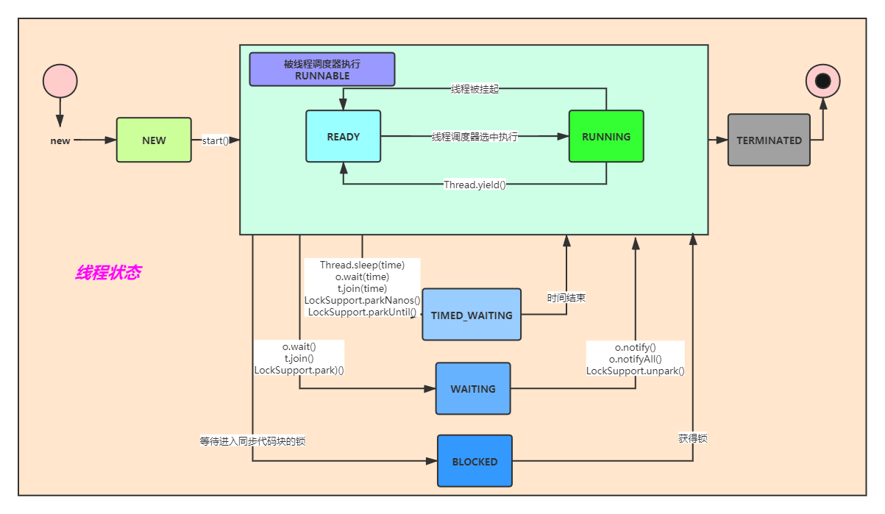
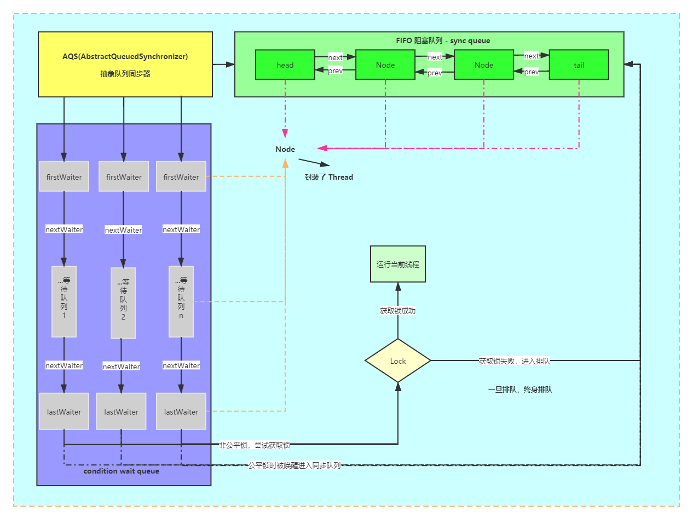
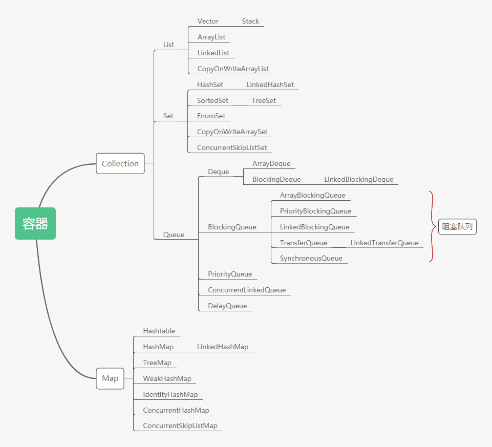
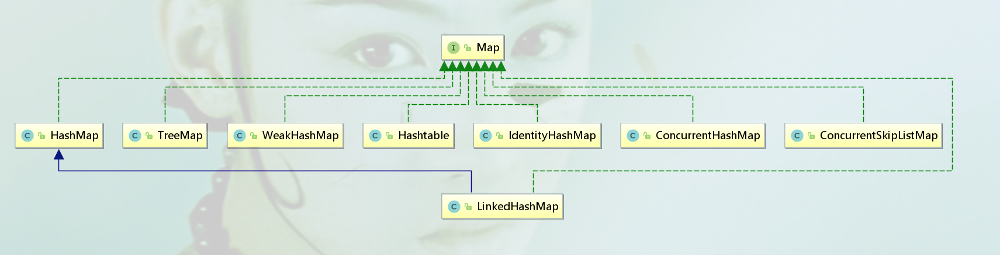
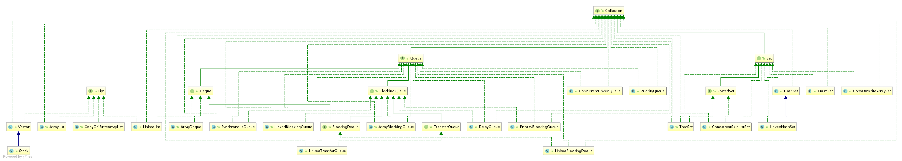

## 个人笔记整理 - Shadow
  
### Thread

    1、Thread类的重要方法
     ①、sleep()：睡眠一段时间，不会释放锁
     ②、yield()：让出cpu执行时间，但也参与下一次的CPU时间争抢
     ③、join()：等待另外一个线程结束，哪个线程调用另外一个线程的join方法则这个线程等待另外那个线程执行结束
     ④、start()：启动线程，底层调用操作系统的函数
     ⑤、run()：真正执行的方法
    
    2、线程状态 Thread.State
     ①、NEW ：线程新建状态 new Thread()
     ②、RUNNABLE：可执行状态，包括READY和RUNNING，start()后
       * READY：线程被挂起（CPU时间片耗完）、Thread.yield()
       * RUNNING：线程调度器选中执行
     ③、BLOCKED：阻塞状态，等待进入同步代码块的锁 
     ④、WAITING：等待状态，o.wait()、t.join()、LockSupport.park()；通过o.notify()、o.notifyAll()、LockSupport.unpark()进入可执行状态
     ⑤、TIMED_WAITING：超时等待状态，Thread.sleep(time)、o.wait(time)、t.join(time)、LockSupport.parkNanos()、LockSupport.parkUntil()；等待时间结束进入可执行状态
     ⑥、TERMINATED：线程销毁状态

   
   
   
    3、启动线程的方式
     ①、new Thread() 方式
     ②、new Runnable() 方式
     ③、线程池ThreadPool方式
   
   
  
### synchronized 关键字
   
   [关于C++代码Monitor对象加锁的底层实现](http://hg.openjdk.java.net/jdk8u/jdk8u/hotspot/file/4ad2d6087d73/src/share/vm/runtime/objectMonitor.cpp)
  
     1、synchronized 的使用
      修饰成员方法 => 锁的是当前对象
      修饰静态方法 => 锁的是当前对象的Class对象
    
     2、字节码层面：
      ACC_SYNCHRONIZED 方法（成员方法或静态方法）
      monitorenter
      monitorexit
     
     3、修饰代码块
      monitorenter
      monitorexit
      一个 monitorenter 对应 monitorexit 可能是 1:1（抛异常情况）或1:2（一般情况）
     
     4、修饰方法（成员或静态方法）
      ACC_SYNCHRONIZED 访问修饰符
     
     5、JVM中的同步是基于进入与退出监视器对象（管程对象）（Monitor）来实现的
     每个对象实例都会有一个Monitor对象，Monitor对象会和Java对象一同创建
     与销毁，Monitor对象是由C++来实现的（OpenJDK）
      
     当多个线程同时访问一段同步代码时，这些线程会被放到一个EntryList集合中，
     处于阻塞状态的线程都会被放到该列表中，接下来，当线程获取到对象的Monitor时，
     Monitor是依赖底层操作系统的mutex lock来实现互斥的，线程获取mutex成功，
     则会持有mutex，这时其他线程就无法再获取到该mutex
 
     如果线程调用了wait方法，那么该线程就会释放掉所持有的mutex，并且该线程会进入
     到WaitSet集合（等待集合）中，等待下一次被其他线程调用notify/notifyAll唤醒，
     如果当前线程顺利执行完毕方法，那么它就会释放掉所持有的mutex；在执行过程中抛异常也会释放锁
     
     总结：
     同步锁在这种实现方式中，业务Monitor是依赖底层操作系统实现，这样就会存在用户态和
     内核态之间的切换，所以会增加性能开销
 
     通过对象互斥锁的概念来保证共享数据操作的完整性，每个对象都对应于一个可称为【互斥锁】
     的标记，这个标记用于保证在任何时刻只能有一个线程访问该对象     
    
     那些处于EntryList与WaitSet中的线程均处于阻塞状态，阻塞操作是由操作系统来完成的，
     在linux下是通过 pthread_mutex_lock函数来完成的，线程被阻塞后便会进入到内核调度状态
     这会导致系统在用户态与内核态之间来回切换，严重影响锁的性能
 
     解决上述问题的办法便是自旋，其原理是：当发生对Monitor的争用时，若Owner能够在很短的时间内
     释放掉锁，则那些争用的线程就可以稍微等待一下（即所谓的自旋），在Owner线程释放锁之后，争用
     线程可能会立刻获取到锁，从而避免了系统阻塞。不过，当Owner运行的时间超过了临界值后，争用线程
     自旋一段时间后依然无法获取到锁，这时争用线程则会停止自旋而进入到阻塞状态。所以总体的思想是：
     不成功再进行阻塞，尽量降低阻塞的可能性，这对那些执行时间很短的代码块来说有极大的性能提升，
     显然，自旋在多处理器（多核心）上才有意义
     
	  互斥锁的属性：
	  1、PTHREAD_MUTEX_TIMED_NP：这是缺省值，也就是普通锁。当一个线程加锁以后，其他请求锁的线程将
	     会形成一个等待队列，并且在解锁后按照优先级获取到锁，这种策略可以确保资源分配的公平性
	  2、PTHREAD_MUTEX_RECURSIVE_NP：嵌套锁。允许一个线程对同一个锁成功获取多次，并通过unlock解锁
	     如果是不同线程请求，则在加锁线程解锁时重新进行竞争
	  3、PTHREAD_MUTEX_ERRORCHECK_NP：检错锁。如果一个线程请求同一个锁，则返回ENEADLK，否则与
	     PTHREAD_MUTEX_TIMED_NP类型动作相同，这样就保证了当不允许多次加锁时不会出现最简单情况下的死锁
	  4、PTHREAD_MUTEX_ADAPTIVE_NP：适应锁，动作最简单的锁类型，仅仅等待解锁后重新竞争
	  

注意：<font color="red">**出现异常会导致锁的释放，o.wait()方法释放锁，o.notify()/o.notifyAll()不释放锁**</font>

### synchronized 锁升级
 
  	  在JDK1.5之前，我们若想实现线程同步，只能通过 synchronized 关键字这一种方式来达成，在底层，Java也是通过
  	  synchronized 关键字来做到数据的原子性维护的；synchronized 关键字是JVM实现的一种内置锁，从底层角度来说，
  	  这种锁的获取与释放都是由JVM帮助我们隐式实现的
 
  	  从JDK1.5开始，并发包引入了 Lock 锁，Lock 同步锁是基于Java来实现的，因此锁的获取与释放都是通过Java代码
  	  来实现与控制的；然而，synchronized 是基于底层操作系统的 Mutex Lock 来实现的，每次对锁的获取与释放动作
  	  都会带来用户态与内核态之间的切换，这种切换会极大的增加系统的负担，在并发量较高时，也就是说锁的竞争比较激
  	  烈时，synchronized 锁在性能上的表现就非常差
 
  	  从JDK1.6开始，synchronized 锁的实现发生了比较大的变化，JVM 引入了相应的优化手段来提升 synchronized 锁
  	  的性能，这种提升涉及到偏向锁、轻量级锁及重量级锁等，从而减少锁的竞争锁带来的用户态与内核态之间的切换；这种
  	  锁的优化实际上是通过Java对象头中的一些标志位来去实现的；对于锁的访问与改变，实际上都是与Java对象头息息相关
 
     从JDK1.6开始，对象实例在堆当中会被划分为三个组成部分：对象头、实例数据与对齐填充
 
     对象头主要由三块内容来构成：
     1.Mark Word
     2.指向类的指针
     3.数组长度（仅限数组对象）
 
     其中Mark Word（它记录了对象、锁及垃圾回收相关的信息，在64位JVM中，其长度也是64bit）的位信息包括了如下组成部分：
     1.无锁标记
     2.偏向锁标记
     3.轻量级锁标记
     4.重量级锁标记
     5.GC标记
 
     对于 synchronized 锁来说，锁的升级主要都是通过 Mark Word中的锁标志位与是否是偏向锁标志位来达成的，synchronized
     关键字所对应的锁都是先从偏向锁开始，随着锁竞争的不断升级，逐步演化至轻量级锁，最后则变成了重量级锁
 
     对于锁的演化来说，它会经历如下阶段：
     无锁 -> 偏向锁 -> 轻量级锁（自旋是轻量级锁中的一种） -> 重量级锁
 
     偏向锁：
     针对于一个线程来说的，它的主要作用就是优化同一个线程多次获取一个锁的情况；如果一个 synchronized 方法被一个线程访问
     那么这个方法所在的对象就会在其 Mark Word中进行偏向锁的标记，同时还会有一个字段来存储该线程的ID；当这个线程再次访问
     同一个 synchronized 方法时，它会检查这个对象的 Mark Word的偏向锁标记以及是否指向了其线程ID，如果是的话，那么该线程
     就无需再去进入管程（Monitor）了，而是直接进入到该方法体中。
     如果是另外一个线程访问这个 synchronized 方法，那么偏向锁会被取消掉
 
     轻量级锁：
     若一个线程已经获取到了当前对象的锁，这时第二个线程又开始尝试争抢该对象的锁，由于该对象的锁已经被第一个线程获取到，因此
     它是偏向锁，而第二个线程在争抢时，会发现该对象头中的Mark Word 已经是偏向锁了，但是里面存储的线程ID并不是自己
     （是第一个线程的ID），那么它会进行CAS（Compare And Swap）,从而获取锁，这里存在2种情况：
     1.获取锁成功：那么它会直接将Mark Word中的线程ID由第一个线程变成自己（偏向锁标记保持不变），这样该对象依然会保持偏向锁状态
     2.获取锁失败：则表示这时可能会有多个线程同时在尝试争抢该对象的锁，那么这时偏向锁就会进行升级，升级为轻量级锁
 
     自旋锁：
     若自旋失败（依然无法获取到锁），那么锁就会转化为重量级锁，在这种情况下，无法获取到锁的线程都会进入到Monitor（即内核态）
     自旋最大的一个特点就是避免了线程从用户态进入到内核态
 
     重量级锁：（自旋10次以后升级为重量级锁 - OS）
     线程最终从用户态进入到内核态，操作系统来进行线程同步控制	   

### 自旋还是系统锁？
    1、执行时间短（加锁代码），线程数少，用自旋
    2、执行时间长，线程数多，用系统锁     
     
     
### JIT编译器对锁的优化    
    1、锁消除
     JIT 编译器（Just In Time编译器）可以在动态编译同步代码时，使用一种叫做逃逸分析的技术，来通过该项技术判别程序中锁使用
     的锁对象是否只被一个线程锁使用，而没有散布到其他线程当中；如果情况就是这样的话，那么JIT编译器在编译这个同步代码时就不会
     生成 synchronized 关键字锁标识的锁的申请与释放机器码，从而消除了锁的使用流程     
    2、锁粗化
     JIT编译器在执行动态编译时，若发现前后相邻的 synchronized 块使用的是同一个锁对象，那么它会把这几个 synchronized 块
     给合并为一个较大的同步块，这样做的好处在于线程在执行这些代码时，就无需频繁申请与释放锁了，从而达到申请与释放锁一次，
     就可以执行完全部的同步代码块，从而提升了性能   
     对应的锁细化：尽可能的减少synchronized块的代码量
     

### 死锁、活锁、饿死
    1、死锁：线程1等待线程2互斥持有的资源，而线程2也在等待线程1互斥持有的资源，两个线程都无法继续执行
    2、活锁：线程持续重试一个总是失败的操作，导致无法继续执行
    3、饿死：线程一直被调度器延迟访问其赖以执行的资源，也许是调度器先于低优先级的线程而执行高优先级的线程，同时总是会有一个
            高优先级的线程可以执行，饿死也叫做无限延迟
     
     
    检测线程死锁的方法：
    1、可视化工具
      ① jvisualvm
      ② jconsole
      ③ jmc
     2、命令行
       jps -l ：找到 java程序进程号
       jstack pid : 查看线程栈信息


            
    
### volatile 关键字
    
     volatile关键字主要有三方面的作用：
      1、实现 long/double 类型变量的原子操作
      2、禁止指令重排序
      3、实现变量的可见性
    
      当使用 volatile关键字修饰变量时，应用就不会从寄存器中获取该变量的值，而是从内存（高速缓存）中获取
    
      volatile与锁类似的地方有两点：
       1、确保变量的内存可见性
       2、禁止指令重排序
    
      volatile可以确保对变量写操作的原子性，但不具备排他性
      另外的重要一点在于：使用锁可能会导致线程的上下文切换（内核态与用户态之间的切换），但使用volatile并不会出现这种情况
    
      不能保证原子操作
      volatile int a = b + 1;
      volatile int a = a++;
      一般直接赋值，这样用
      volatile int count = 1;
      volatile boolean flag = false;
    
      如果要实现volatile写操作的原子性，那么在等号右侧的赋值变量中就不能出现被多线程所共享的变量，哪怕这个变量也是被volatile修饰
    
      volatile Date date = new Date();
    
      禁止指令重排序与实现变量的可见性都是通过一种手段来实现的：内存屏障（memory barrier）
    
      int a = 1;
      String s = "hello";
    
      内存屏障（Release Barrier，释放屏障）
      volatile boolean v = false; // 写操作
      内存屏障（Store Barrier，存储屏障）
    
      Release Barrier：防止下面的volatile与上面的所有操作的指令重排序
      Store Barrier：重要作用是刷新处理器缓存，结果是可以确保该存储屏障之前一切的操作所生成的结果对于其他处理器来说都可见
    
      内存屏障（Load Barrier，加载屏障）
      boolean v1 = v; //读操作
      内存屏障（Acquier Barrier，获取屏障）
      int a = 1;
      String s = "world";
    
      Load Barrier：可以刷新处理器缓存，同步其他处理器对该volatile遍历的修改结果
      Acquire Barrier：可以防止上面的volatile读取操作与下面的所有操作语句的指令重排序
    
      对于volatile关键字冰冷的读写操作，本质上都是通过内存屏障来执行的
      内存配置兼具了两方面的能力：1、禁止指令重排序；2、实现变量内存的可见性
    
      1、对于读取操作来说，volatile可以确保该操作与其后续的所有读写操作都不会进行指令重排序
      2、对于修改操作来说，volatile可以确保该操作与其上面的所有读写操作都不会进行指令重排序
    
    
      volatile常见场景：
       1、DCL（双重检查）单例 - 为了禁止指令重排序（CPU）
       2、JUC并发包

    
### Java内存模型(JMM)以及 happens-before [Java规范关于JMM的说明](https://docs.oracle.com/javase/specs/jls/se7/html/jls-17.html#jls-17.4)  
       
       1、变量的原子性问题 
       2、变量的可见性问题
       3、变量修改的时序性问题
    
       happens-before重要规则：
       1、顺序执行规则（限定在单个线程上的）：该线程的每个动作都happen-before它的后面的动作
       2、隐式锁（monitor）规则：一个线程的 unlock happen-before 另外一个线程的 lock，之前的线程对于同步代码块的所有执行结果对于后续获取锁的线程来说都是可见的
       3、volatile读写规则：对于一个volatile变量的写操作一定会 happen-before后续对该变量的读操作
       4、多线程的启动规则：Thread对象的start方法happen-before该线程run方法中的任何一个动作，包括在其中启动的任何子线程
       5、多线程的终止规则：一个线程启动一个子线程，并且调用了子线程的join方法等待其结束，那么当子线程结束后，父线程的接下来的所有操作都可以看到子线程run方法中的执行结果
       6、线程的中断规则：可以调用interrupt方法来中断线程，这个调用happen-before对该线程中断的检查（isInterrupted）
        
    
    
### synchronized与volatile
    1、synchronized     
     ①、保证线程可见性
     ②、保证有序性（无法禁止指令重排序，由于同一时刻只能有一个线程执行，存在as-if-serial语义，因此保证有序性）
     ③、保证原子性
       - 不能用String常量，Integer，Long
       - 锁的是对象不是代码
       - 代码块使用对象加锁时最好限定对象 final 修饰
       - 成员方法锁的是当前对象 this
       - 静态方法锁的是当前类Class对象
       - 锁升级：偏向锁-自旋锁（轻量级锁）- 重量级锁
       - 线程数少-自旋；多-重量级锁
       - 操作耗时长-重量级锁
            
    2、volatile
     ①、保证线程可见性
     ②、禁止指令重排序
     ③、无法保证原子性
       - 保证线程可见性：MESI、缓存一致性协议
       - 禁止指令重排序（读写屏障：loadfence、storefence原语指令）


        
 
### 问题：为什么synchronized无法禁止指令重排序，却能保证有序性？
    1、为了进一步提升计算机各方面能力，在硬件层面做了很多优化，如处理器优化和指令重排等，但是这些技术的引入就会导致有序性问题
    2、最好的解决有序性问题的办法，就是禁止处理器优化和指令重排，就像volatile中使用内存屏障一样（读写屏障是为了禁止指令重排序）
    3、在Java中，不管怎么排序，都不能影响单线程程序的执行结果。这就是as-if-serial语义，所有硬件优化的前提都是必须遵守as-if-serial语义
    4、synchronized，他是Java提供的锁，可以通过他对Java中的对象加锁，并且他是一种排他的、可重入的锁
    5、synchronized通过排他锁的方式就保证了同一时间内，被synchronized修饰的代码是单线程执行的。所以呢，这就满足了as-if-serial语义的一个关键前提，那就是单线程，因为有as-if-serial语义保证，单线程的有序性就天然存在了    
    
  


     
### Lock、Condition、AQS同步器     
   
     1、关于 Lock 与 synchronized 关键字在锁的处理上的重要差别：
        ① 锁的获取方式：前者是通过程序代码的方式由开发者手工获取，后者是通过JVM来获取（无需开发者干预）
        ② 具体实现方式：前者是通过Java代码的方式来实现，后者是通过JVM底层来实现（无需开发者关注）
        ③ 锁的释放方式：前者务必通过unlock()方法在finally块中手工释放锁，后者是通过JVM来释放（无需开发者关注）
        ④ 锁的具体类型：前者提供了多种锁，如公平锁、非公平锁，后者是非公平锁；二者都提供了可重入锁
     
     
     2、Condition -> await()、signal()、signalAll() + Lock 类 [multiple wait sets]
        Object    -> wait()、notify()、notifyAll() + synchronized 关键字 [waitSet + EntryList]
       ①传统上，我可以通过synchronized关键字 + wait、notify、notifyAll 来实现多个线程之间的协调与通信，
        整个过程都是JVM来帮助我们实现的，开发者无需（也无法）了解底层的实现细节
       ②从JDK5开始，并发包提供了Lock、Condition（await、signal、signalAll）来实现多个线程之间的协调与通信，
        整个过程都是由开发者来控制的，而且相比于传统方式，更加灵活，功能也更加强大
        
       Condition的方法：
        1、await()：线程进入等待状态，并释放与之关联的Lock，直到被signalled或interrupted
           四种情况被唤醒：
           ① 别的线程调用了同一个 Condition 的 signal()方法且当前线程被选中为被唤醒的线程时
           ② 别的线程调用同一个 Condition 的 signalAll()方法
           ③ 别的线程 interrupts 中断当前线程且支持线程挂起中断
           ④ 虚假唤醒发生
           在所有情况下，在此方法可以返回当前线程之前必须重新获取与此 Condition 关联的锁
        2、signal()：**唤醒一个等待的线程**，如果存在多个线程在 Condition 等待，则选择其中的一个进行唤醒，在 wait 返回前线程必须获取到关联的 Lock
        3、signalAll()：**唤醒所有等待的线程** ，在 wait 返回前每个线程必须重新获取关联的 Lock       

      **Condition 的经典使用自行查阅 ArrayBlockingQueue 的实现**
    
     3、Thread.sleep 与 await（或者是 Object的wait方法）的本质区别：
        sleep方法本质上不会释放锁，而await会释放锁，并且在 signal 后，还需要重新获得锁才能继续执行（该行为与Object的wait方法完全一致）    
    
     4、综合运用 => Test02  
  
  

### CAS 、原子类 Atomicxxx、原子引用 AtomicReference/AtomicStampReference
    1、CAS ==> Test07
     ①、synchronized关键字与Lock等锁机制都是悲观锁：无论做任何操作，首先都需要先上锁，接下来再去执行后续操作，从而确保了
       接下来的所有操作都是由当前这个线程来执行的
     ②、乐观锁：线程在操作之前不会做任何预先处理，而是直接去执行；当在最后执行变量更新的时候，当前线程需要有一种机制来确保
       当前被操作的变量是没有被其他线程修改的；CAS是乐观锁的一种极为重要的实现方式
  
     CAS（Compare And Swap/Set）
     比较与交换：这是一个不断循环的过程，一直到变量值被修改成功为止；CAS本身是由硬件指令来提供支持的，换句话说，硬件中是通过
     一个原子指令来实现比较与交换的；因此，CAS可以确保变量操作的原子性
  
  
     对于CAS来说，其操作数主要涉及到如下三个：
      1.需要被操作的内存值V（主内存值）
      2.需要进行比较的值A（期望的值，即当前线程读取到的值）
      3.需要进行写入的值B（更新值）
     只有当V==A的时候，CAS才会通过原子操作的手段来将V的值更新成功，并且返回旧值
   
     关于CAS的限制或问题：
      1.循环开销问题：并发量大的情况下会导致线程一直自旋
      2.只能保证一个变量的原子操作：可以通过AtomicReference来实现对多个变量的原子操作
      3.ABA问题：1 -> 2 -> 1，经过修改之后再改回来的问题
      
      ABA问题的解决办法：使用带版本号的原子引用 AtomicStampedReference
       

### 关于 synchronized、Atomic原子类、LongAdder的性能测试
```java
public class Test01 {
	final Object lock = new Object();
	static long count1 = 0L;
	static AtomicLong count2 = new AtomicLong(0L);
	static LongAdder count3 = new LongAdder();

	public static void main(String[] args) throws InterruptedException {
		Thread[] threads = new Thread[1000];
		// synchronized
		Test01 test01 = new Test01();
		for (int i = 0; i < threads.length; i++) {
			threads[i] = new Thread(() ->{
				for (int j = 0; j < 100000; j++) {
					test01.increment();
				}
			});
		}
		long start = System.currentTimeMillis();
		for (Thread thread : threads) {
			thread.start();
		}
		for (Thread thread : threads) {
			thread.join();
		}
		System.out.println("值为："+ count1 +" sync 耗时：" + (System.currentTimeMillis() - start));

		// atomic
		for (int i = 0; i < threads.length; i++) {
			threads[i] = new Thread(() ->{
				for (int j = 0; j < 100000; j++) {
					count2.getAndIncrement();
				}
			});
		}
		start = System.currentTimeMillis();
		for (Thread thread : threads) {
			thread.start();
		}
		for (Thread thread : threads) {
			thread.join();
		}
		System.out.println("值为："+ count2.get() +" atomic 耗时：" + (System.currentTimeMillis() - start));

		// longAdder
		for (int i = 0; i < threads.length; i++) {
			threads[i] = new Thread(() ->{
				for (int j = 0; j < 100000; j++) {
					count3.increment();
				}
			});
		}
		start = System.currentTimeMillis();
		for (Thread thread : threads) {
			thread.start();
		}
		for (Thread thread : threads) {
			thread.join();
		}
		System.out.println("值为："+ count3.longValue() +" longAdder 耗时：" + (System.currentTimeMillis() - start));
	}

	public void increment() {
		synchronized (lock){
			count1++;
		}
	}
}
```


### ReentrantLock、ReentrantReadWriteLock
    1、ReentrantLock 方法
     ① lock() ：加锁
     ② unlock() ：释放锁
     ③ tryLock() ：尝试加锁
     ④ lockInterruptibly() ：可中断的加锁
     ⑤ ReentrantLock(fair) ： 构造方法，可选择公平与非公平
    2、ReentrantReadWriteLock 方法
     ① readLock() ： 读锁
     ② writeLock() ：写锁
     ③ ReentrantReadWriteLock(fair) ：构造方法，可选择公平与非公平


### CountDownLatch、CyclicBarrier、Phaser、Semaphore、Exchanger
  
    1、CountDownLatch => Test04
     允许一个或多个线程等待在其他线程中执行的一组操作完成
     ① countDown()：调用此方法需在 finally 块中，子任务每执行完一次调用一次
     ② await()：主线程等待，直到维护的state变量值变为0，可多次等待，如果state已经是0则会立即执行 private volatile int state
     ③ await(time)：超时等待，时间过来住线程立即执行，不会等待子线程全部执行完毕
     ④ CountDownLatch 不可重用
     
    
    2、CyclicBarrier => Test05
     栅栏，多个任务全部到达后（最后一个线程到达）再继续执行，不存在子任务的概念
     ① await()：线程等待所有的任务到达屏障
     ② await(time)：超时等待，会抛异常
     ③ CyclicBarrier(int,Runnable) ：构造方法
     > 底层执行逻辑：
      1.初始化CyclicBarrier中的各种成员变量，包括parties、count和Runnable（可选）
      2.当调用await方法时，底层会先检查计数器是否已经归零，如果是的话，那么就首先执行可选的Runnable，接下来开始下一个Generation
      3.在下一个分代中，将会重置count值为parties，并且创建新的Generation实例
      4.同时会调用Condition的signalAll方法，唤醒所有的在屏障前面等待的线程，让其开始继续执行
      5.如果计数器没有归零，那么当前的调用线程将会通过Condition的await方法，在屏障前进行等待
      6.以上所有执行流程均在Lock锁的控制范围内，不会出现并发问题（--count）
  
     > 更好的对 CountDownLatch 与 CyclicBarrier 的理解：==> Test05
        CyclicBarrier：赛跑前先来的选手需要等待其他选手入场，然后进行比赛，栅栏可重用
        CountDownLatch：需要等待所有赛跑选手到达目的地后才可结束比赛，闭锁不可重用

     3、Semaphore ==> Test08
       信号量通常用于限制线程的数量访问一些(物理或逻辑)资源。举个例子一个使用信号量来控制访问资源的线程数量
       ① acquire() ：获取锁，阻塞方法
       ② release() : 释放锁
       ③ Semaphore(int) ：构造方法，指定限定数
       ③ Semaphore(int, fair) ：构造方法，指定限定数及是否公平
       
      > 限流 => 类比高速收费站
     
     4、Phaser => Test09
       多个栅栏，可看做是CountDownLatch和CyclicBarrier的结合
       ① bulkRegister(int) ：规定桶的数量
       ② arriveAndAwaitAdvance() ：继续参与下一个栅栏
       ③ arriveAndDeregister() ：不在参与下一个栅栏
       ④ onAdvance() ： 栅栏被推倒的时候自动回调的方法
      
     5、Exchanger => Test10
      ① exchange(r)：交换
      ② exchange(r,t,u)：超时交换
      > 只能是2个线程间的数据交互；如游戏中2个人交换装备
      

### ReentrantLock（Lock） 与 ReentrantReadWriteLock（ReadWriteLock）
    二者性能测试 => Test11
    1、ReentrantLock
     ① lock()
     ② unlock()
     
     对于ReentrantLock来说，其执行逻辑如下所示：
     1. 尝试获取对象的锁，如果获取不到（意味着已经有其他线程持有了锁，并且尚未释放），那么它就会进入到AQS的阻塞队列中。
     2. 如果获取到，那么根据锁是公平锁还是非公平锁来进行不同的处理：
       ① 如果是公平锁，那么线程会直接放置到AQS阻塞队列的末尾进行排队
       ② 如果是非公平锁，那么线程会首先尝试进行CAS计算，如果成功，则直接获取到锁
         如果失败，则与公平锁的处理方式一致，被放到阻塞队列末尾进行排队，一旦排队，终身排队
     3. 当锁释放时（调用unlock方法），那么底层会调用release方法对state成员变量值进行减一操作，如果减一后，state值不为0
        那么release操作就执行完毕；如果减一操作后，state值为0，则调用LockSupport的unpark方法唤醒该线程后的等待队列中的
        第一个后续线程，将其唤醒，使之能够获取到对象的锁（release时，对于公平锁与非公平锁的处理逻辑是一致的）；之所以调用
        release方法后state值可能不为零，原因在于ReentrantLock是可重入锁，表示线程可以调用多次lock方法，导致每调用一次
        state的值都会加一
      
      对于ReentrantLock来说，所谓的上锁，本质上就是对AQS中的state成员变量的操作：对state+1表示上锁；对state-1表示释放锁
        
     
    2、ReentrantReadWriteLock
     ① readLock().lock()
     ② readLock().unlock()
     ③ writeLock().lock()      
     ④ writeLock().unlock()      
    > 读锁共享锁、写锁互斥锁
    
     关于ReentrantReadWriteLock的执行逻辑：
     1. 读锁：
       ① 在获取读锁时，会尝试判断当前对象是否拥有了写锁，如果已经拥有，则直接失败
       ② 如果没有写锁，就表示当前对象没有排它锁，则当前线程会尝试给对象加锁
       ③ 如果当前线程已经持有了该对象的锁，那么直接将读锁数量+1
       
     2. 写锁：
       ① 在获取写锁时，会尝试判断当前对象是否拥有了锁（读锁与写锁），如果已经拥有且持有的线程并非当前线程，直接失败
       ② 如果当前对象没有被加锁，那么写锁就会为当前对象上锁，并且将写锁的个数+1
       ③ 将当前对象的排它锁线程持有者设为自己
       
       

### ReentrantLock 与 synchronized 比较
    1、CAS 与 synchronized锁升级
    2、tryLock 尝试获取锁
    3、lockInterruptibly 可被中断
    4、ReentrantLock可实现公平与非公平


### <font color="blue">AQS（AbstractQueuedSynchronizer）抽象队列同步器</font>
    
    1、ConditionObject impl Condition ，其中每一个Condition都维护了一个等待队列（类似synchronized中的 waitSet）=> await()、signal()、signalAll()
    2、Node 双向阻塞队列FIFO（类似synchronized中的EntryList），持有线程对象
    3、private volatile int state; 同步状态，在不同的实现中作用不一样
      ① ReentrantLock - 加锁状态，为 0 时则表示未加锁状态，大于0则表示加锁状态（可重入锁）
      ② ReentrantReadWriteLock - 分为前高16位来表示读的状态和低16位来表示写的状态
      ③ CountDownLatch - 需要 countDown的次数
      ④ Semaphore - 信号量大小
    
   

   [关于LockSupport的park、unpark方法的底层实现](http://hg.openjdk.java.net/jdk8u/jdk8u/hotspot/file/4ad2d6087d73/src/os/linux/vm/os_linux.cpp)
    


### <font color="red">重点：关于AQS与synchronized关键字之间的关系 - 对照理解</font>

    1、synchronized：
     ①、synchronized关键字在底层的C++实现中，存在两个重要的数据结构（集合）：WaitSet、EntryList
     ②、WaitSet中存放的是调用了Object的wait方法的线程对象（被封装成了C++的Node对象）    
     ③、EntryList中存放的是陷入到阻塞状态、需要获取monitor的那些线程对象
     ④、当一个线程被notify后，它就会从WaitSet中移动到EntryList中
     ⑤、进入到EntryList后，该线程依然需要与其他线程争抢monitor对象
     ⑥、如果争抢到，就表示该线程获取到了对象的锁，它就可以以排他方式执行对应的同步代码
    
    2、AQS：
     ①、AQS中存在两种队列，分别是Condition对象上的条件队列wait queue，以及AQS本身的阻塞队列sync queue
     ②、这两个队列中的每一个对象都是Node实例（里面封装了线程对象）
     ③、当位于Condition条件队列中的线程被其他线程signal后，该线程就会从条件队列中移动到AQS的阻塞队列中
     ④、位于AQS阻塞队列中的Node对象本质上都是由一个双向链表来构成的
     ⑤、在获取AQS锁时，这些进入到阻塞队列中的线程会按照在队列中的排序先后尝试获取锁
     ⑥、当AQS阻塞队列中的线程获取到锁后，就表示该线程已经可以正常执行了
     ⑦、陷入到阻塞状态的线程，依然需要进入到操作系统的内核态，进入阻塞（park方法实现）
    
    

### 关于AQS在高版本JDK中的调整
    1、JDK9设置 head 和 tail 结点时，采用了 VarHandle 
    2、JDK8设置 head 和 tail 结点时，使用的是 CAS
    
    
    VarHandle：com/shadow/concurrent/other/Test02.java
     1、普通属性原子性操作
     2、比反射快，直接操纵二进制码
     


### ThreadLocal
    本质上，ThreadLocal是通过空间来换取时间，从而实现每个线程当中都会有一个变量的副本，这样每个线程都会操作该副本，从而完全规避了多线程的并发问题
    
    Java中存在的四种类型的引用：
     1、强引用（strong）：内存不够时，GC也不会回收的对象
     2、软引用（soft）：内存不够时，GC时会进行回收，内存够时不回收
     3、弱引用（weak）：发生GC就会回收
     4、虚引用（phantom）：很少使用，结合引用队列Queue - 开发JVM会使用到 - Queue中接收到去释放堆外内存
     
     - WeakHashMap 的用途
     
     Thread => ThreadLocalMap<Entry<ThreadLocal,Object>>
   
    
    
    经典用途：
    1、Spring声明式事务（传递Connection，多个业务方法获取到同一个Connection对象）
    2、多数据源的切换
    3、自定义对象在线程中传递 - 如：用户信息

    ThreadLocal的内存泄漏问题：
    1、弱引用可以有效的让ThreadLocal对象被回收，但是被回收后 Entry 的key将变成 null，那么 value将不会被访问到，造成内存泄漏
    2、有效的避免内存泄漏问题，使用完之后调用 ThreadLocal的 remove方法 


### 并发容器 CopyOnWriteList、ConcurrentHashMap、ConcurrentSkipListMap、BlockingQueue
   
    - 建议背过
    
   
   
   
    
    1、Vector、Hashtable
     - 自带锁，基本不用
    2、HashMap -> ConcurrentHashMap
     - 各有各的用途、ConcurrentHashMap 读性能优
    3、Vector -> Queue
     - Queue 与 List 区别
      ① 添加了对线程友好的API：offer、peek、poll
      ② BlockingQueue又添加了 put、take阻塞方法 - 底层 Lock-Condition-park-unpark实现 - 生产者消费者问题
    4、DelayQueue - PriorityQueue[排序的队列，二叉树]
     - 按时间进行任务调度
    5、SynchonouseQueue
     - 容量为 0 
     - 功能类似 Exchanger
    6、TransferQueue
     - transfer()方法
     
    
    

### Callable、Future、FutureTask（RunnableFuture）、CompletableFuture

    1、Callable
     类似 Runnable，有返回值，可以抛异常
    
    2、Future
     表示一个异步计算的结果
     ① get()/get(time)：获取异步计算的结果，可能会被阻塞
     ② cancel() ：取消任务
     ③ isCancelled()：boolean 是否被取消
     ④ isDone()：是否完成，包括正常执行完成、被取消、抛异常

    3、FutureTask（Future + Runnable）
     常用的Future实现
      ① FutureTask(Callable)：Callable参数的构造方法
      ② FutureTask(Runnable,r)：Runnable参数的构造方法 - 最终会被转换为Callable
      
    4、CompletableFuture - 底层使用 ForkJoinPool
      ① supplyAsync()：有返回结果的异步执行方法
      ② runAsync()：五返回结果的异步执行方法
      ③ thenApplyAsync()：继续执行异步方法
      ④ thenCombineAsync()：合并任务
      ⑤ whenComplete()：任务完成回调方法
      ⑥ allOf()：所有的任务
      ⑦ anyOf()：任何一个任务
      

      
### 线程池 ThreadPoolExecutor（ExecutorService/Executor）、ForkJoinPool

   1、ThreadPoolExecutor
   
     ① 线程池七大参数
      1.int corePoolSize：核心线程数;线程池当中所一直维护的线程数量，如果线程池处于任务空闲期间，那么该线程不会被回收
      2.int maximunPoolSize：最大线程数;线程池中所维护的线程数的最大数量
      3.long keepAliveTime：线程存活时间;超过了corePoolSize的线程在经过keepAliveTime时间后如果一直处于空闲状态，那么超过的这部分线程将会被回收掉
      4.TimeUnit unit：存活时间单位;即keepAliveTime的时间单位
      5.BlockingQueue workQueue：任务队列（阻塞队列）;向线程池所提交的任务位于的阻塞队列，它的实现有多种方式
       ① LinkedBlockingQueue -> 默认 Integer 最大值的queue
       ② SynchronusQueue -> 容量为0的queue
       ③ ArrayBlockingQueue -> 固定容量的queue
      6.ThreadFactory threadFactory：线程工厂;用于创建新的线程并被线程池所管理，默认线程工厂所创建的线程都是用户线程且优先级为正常优先级
       ① ThreadFactory接口 Executors.DefaultThreadFactory
      7.RejectedExecutionHandler handler： 拒绝策略;表示当线程池中的线程都在忙于执行任务且阻塞队列也已经满了的情况下，新到来的任务该如何被对待和处理，JDK默认提供了四种
       ① AbortPolicy：直接抛出一个运行时异常(throw RejectedExecutionException)
       ② DiscardPolicy：默默地丢掉提交的任务，什么都不做且不抛出任何异常（什么也不做）
       ③ DiscardOldestPolicy：丢弃掉阻塞队列中存放时间最久的任务（队头元素），并且为当前所提交的任务留出一个队列中的空闲空间，以便将其放进到队列中（poll()+execute(r)）
       ④ CallerRunsPolicy：直接由提交任务的线程来运行这个提交的任务（r.run()）
       
       一般情况下，自定义拒绝策略：实现RejectedExecutionHandler接口
        - 比如记录日
        - 存入 kafka，redis，mysql等
        - try times
       
        
        
      ② JDK自带的线程池实现
       1.Executors.newSingleThreadExecutor
       2.Executors.newFixedThreadPool
        ① new LinkedBlockingQueue<Runnable>()：任务队列Integer.MAX_VALUE，存在资源耗尽风险
       3.Executors.newCachedThreadPool
       4.Executors.newScheduledThreadPool
        ① maximumPoolSize = Integer.MAX_VALUE：最大线程数Integer.MAX_VALUE，存在资源耗尽风险
       以上底层均使用 ThreadPoolExecutor
       5.Executors.newWorkStealingPool：底层使用ForkJoinPool
       
        
      ③ 为什么要单线程的线程池？
        1.任务队列
        2.线程生命周期管理
        
      ④ Scheduled定时任务线程池
       1.quartz -> cron
       2.xx-job
       3.Spring自带
       
      对于线程池来说，其提供了execute与submit两种方式来向线程池提交任务
      总体来说，submit方法是可以取代execute方法的，因为它即可以接收Callable任务，也可以接收Runnable任务（最终会被转换为Callable类型Executors.callable()方法）
      
      关于线程池的总体执行策略：（源码可参考）
       ① 如果线程池中正在执行的线程数 < corePoolSize，那么线程池就会优先选择创建新的线程而非将提交的任务添加到阻塞队列中
       ② 如果线程池中正在执行的线程数 >= corePoolSize，那么线程池就会优先选择对提交的任务进行阻塞排队而非创建新的线程
       ③ 如果提交的任务无法加入到阻塞队列当中，那么线程池就会创建新的线程；
       ④ 如果创建的线程数超过了 maximumPoolSize，那么决绝策略就会起作用
       ⑤ 如果线程池任务慢慢减少，空闲的超过corePoolSize的线程将根据设置的 keepAliveTime与TimeUnit 对非核心线程进行销毁，直到核心线程数
      
      
      关于线程池任务提交的总结：
       ① 两种提交方式：submit与execute
       ② submit有三种方式，无论哪种方式，最终都是将传递进来的任务转换为一个Callable对象进行处理
       ③ 当Callable对象构造完毕后，最终都会调用Executor接口中声明的execute方法进行统一的处理
      
      
      对于线程池来说，存在两个状态需要维护：
       ① 线程池本身的状态：ctl的高三位来表示
       ② 线程池中所运行的线程的数量：ctl的其余29位来表示
       
      线程池一共存在五种状态：
       ① RUNNING：线程池可以接收新的任务提交，并且还可以正常处理阻塞队列中的任务
       ② SHUTDOWN：不再接收新的任务提交，不过线程池可以继续处理阻塞队列中的任务
       ③ STOP：不再接收新的任务，同时还会丢弃阻塞队列中的既有的任务，此外它还会中断正在处理中的任务
       ④ TIDYING：所有的任务都执行完毕后（同时也涵盖了阻塞队列中的任务），当前线程池中的活动的线程数量将为0，将会调用 terminated方法
       ⑤ TERMINATED：线程池的终止状态，当terminated方法执行完毕后，线程池将会处于该状态
       
       RUNNING -> SHUTDOWN：当调用了线程池的shutdown方法时，或者当finalize方法被隐式调用后（该方法内部会调用shutdown方法）
       RUNNING、SHUTDOWN -> STOP：当调用了线程池的shutdownNow方法时
       SHUTDOW -> TIDYING：在线程池与阻塞队列均变为空时
       STOP -> TIDYING：在线程池变为空时
       TIDYING -> TERMINATED：在terminated方法被执行完毕时
       
      
      
   2、ThreadPoolExecutor源码解读
   
    1.常用变量的解释 
   ```java
// 1. `ctl`，可以看做一个int类型的数字，高3位表示线程池状态，低29位表示worker数量
private final AtomicInteger ctl = new AtomicInteger(ctlOf(RUNNING, 0));
// 2. `COUNT_BITS`，`Integer.SIZE`为32，所以`COUNT_BITS`为29
private static final int COUNT_BITS = Integer.SIZE - 3;
// 3. `CAPACITY`，线程池允许的最大线程数。1左移29位，然后减1，即为 2^29 - 1
private static final int CAPACITY   = (1 << COUNT_BITS) - 1;

// runState is stored in the high-order bits
// 4. 线程池有5种状态，按大小排序如下：RUNNING < SHUTDOWN < STOP < TIDYING < TERMINATED
private static final int RUNNING    = -1 << COUNT_BITS;
private static final int SHUTDOWN   =  0 << COUNT_BITS;
private static final int STOP       =  1 << COUNT_BITS;
private static final int TIDYING    =  2 << COUNT_BITS;
private static final int TERMINATED =  3 << COUNT_BITS;

// Packing and unpacking ctl
// 5. `runStateOf()`，获取线程池状态，通过按位与操作，低29位将全部变成0
private static int runStateOf(int c)     { return c & ~CAPACITY; }
// 6. `workerCountOf()`，获取线程池worker数量，通过按位与操作，高3位将全部变成0
private static int workerCountOf(int c)  { return c & CAPACITY; }
// 7. `ctlOf()`，根据线程池状态和线程池worker数量，生成ctl值
private static int ctlOf(int rs, int wc) { return rs | wc; }

/*
 * Bit field accessors that don't require unpacking ctl.
 * These depend on the bit layout and on workerCount being never negative.
 */
// 8. `runStateLessThan()`，线程池状态小于xx
private static boolean runStateLessThan(int c, int s) {
    return c < s;
}
// 9. `runStateAtLeast()`，线程池状态大于等于xx
private static boolean runStateAtLeast(int c, int s) {
    return c >= s;
}
```
    2.构造方法
   ```java
public ThreadPoolExecutor(int corePoolSize,
                          int maximumPoolSize,
                          long keepAliveTime,
                          TimeUnit unit,
                          BlockingQueue<Runnable> workQueue,
                          ThreadFactory threadFactory,
                          RejectedExecutionHandler handler) {
    // 基本类型参数校验
    if (corePoolSize < 0 ||
        maximumPoolSize <= 0 ||
        maximumPoolSize < corePoolSize ||
        keepAliveTime < 0)
        throw new IllegalArgumentException();
    // 空指针校验
    if (workQueue == null || threadFactory == null || handler == null)
        throw new NullPointerException();
    this.corePoolSize = corePoolSize;
    this.maximumPoolSize = maximumPoolSize;
    this.workQueue = workQueue;
    // 根据传入参数`unit`和`keepAliveTime`，将存活时间转换为纳秒存到变量`keepAliveTime `中
    this.keepAliveTime = unit.toNanos(keepAliveTime);
    this.threadFactory = threadFactory;
    this.handler = handler;
}
```
    3.提交执行task的过程
   ```java
public void execute(Runnable command) {
    if (command == null)
        throw new NullPointerException();
    /*
     * Proceed in 3 steps:
     *
     * 1. If fewer than corePoolSize threads are running, try to
     * start a new thread with the given command as its first
     * task.  The call to addWorker atomically checks runState and
     * workerCount, and so prevents false alarms that would add
     * threads when it shouldn't, by returning false.
     *
     * 2. If a task can be successfully queued, then we still need
     * to double-check whether we should have added a thread
     * (because existing ones died since last checking) or that
     * the pool shut down since entry into this method. So we
     * recheck state and if necessary roll back the enqueuing if
     * stopped, or start a new thread if there are none.
     *
     * 3. If we cannot queue task, then we try to add a new
     * thread.  If it fails, we know we are shut down or saturated
     * and so reject the task.
     */
    int c = ctl.get();
    // worker数量比核心线程数小，直接创建worker执行任务
    if (workerCountOf(c) < corePoolSize) {
        if (addWorker(command, true))
            return;
        c = ctl.get();
    }
    // worker数量超过核心线程数，任务直接进入队列
    if (isRunning(c) && workQueue.offer(command)) {
        int recheck = ctl.get();
        // 线程池状态不是RUNNING状态，说明执行过shutdown命令，需要对新加入的任务执行reject()操作。
        // 这儿为什么需要recheck，是因为任务入队列前后，线程池的状态可能会发生变化。
        if (! isRunning(recheck) && remove(command))
            reject(command);
        // 这儿为什么需要判断0值，主要是在线程池构造方法中，核心线程数允许为0
        else if (workerCountOf(recheck) == 0)
            addWorker(null, false);
    }
    // 如果线程池不是运行状态，或者任务进入队列失败，则尝试创建worker执行任务。
    // 这儿有3点需要注意：
    // 1. 线程池不是运行状态时，addWorker内部会判断线程池状态
    // 2. addWorker第2个参数表示是否创建核心线程
    // 3. addWorker返回false，则说明任务执行失败，需要执行reject操作
    else if (!addWorker(command, false))
        reject(command);
}
```
    4.addworker源码解析
   ```java
private boolean addWorker(Runnable firstTask, boolean core) {
    retry:
    // 外层自旋
    for (;;) {
        int c = ctl.get();
        int rs = runStateOf(c);

        // 这个条件写得比较难懂，我对其进行了调整，和下面的条件等价
        // (rs > SHUTDOWN) || 
        // (rs == SHUTDOWN && firstTask != null) || 
        // (rs == SHUTDOWN && workQueue.isEmpty())
        // 1. 线程池状态大于SHUTDOWN时，直接返回false
        // 2. 线程池状态等于SHUTDOWN，且firstTask不为null，直接返回false
        // 3. 线程池状态等于SHUTDOWN，且队列为空，直接返回false
        // Check if queue empty only if necessary.
        if (rs >= SHUTDOWN &&
            ! (rs == SHUTDOWN &&
               firstTask == null &&
               ! workQueue.isEmpty()))
            return false;

        // 内层自旋
        for (;;) {
            int wc = workerCountOf(c);
            // worker数量超过容量，直接返回false
            if (wc >= CAPACITY ||
                wc >= (core ? corePoolSize : maximumPoolSize))
                return false;
            // 使用CAS的方式增加worker数量。
            // 若增加成功，则直接跳出外层循环进入到第二部分
            if (compareAndIncrementWorkerCount(c))
                break retry;
            c = ctl.get();  // Re-read ctl
            // 线程池状态发生变化，对外层循环进行自旋
            if (runStateOf(c) != rs)
                continue retry;
            // 其他情况，直接内层循环进行自旋即可
            // else CAS failed due to workerCount change; retry inner loop
        } 
    }
    boolean workerStarted = false;
    boolean workerAdded = false;
    Worker w = null;
    try {
        w = new Worker(firstTask);
        final Thread t = w.thread;
        if (t != null) {
            final ReentrantLock mainLock = this.mainLock;
            // worker的添加必须是串行的，因此需要加锁
            mainLock.lock();
            try {
                // Recheck while holding lock.
                // Back out on ThreadFactory failure or if
                // shut down before lock acquired.
                // 这儿需要重新检查线程池状态
                int rs = runStateOf(ctl.get());

                if (rs < SHUTDOWN ||
                    (rs == SHUTDOWN && firstTask == null)) {
                    // worker已经调用过了start()方法，则不再创建worker
                    if (t.isAlive()) // precheck that t is startable
                        throw new IllegalThreadStateException();
                    // worker创建并添加到workers成功
                    workers.add(w);
                    // 更新`largestPoolSize`变量
                    int s = workers.size();
                    if (s > largestPoolSize)
                        largestPoolSize = s;
                    workerAdded = true;
                }
            } finally {
                mainLock.unlock();
            }
            // 启动worker线程
            if (workerAdded) {
                t.start();
                workerStarted = true;
            }
        }
    } finally {
        // worker线程启动失败，说明线程池状态发生了变化（关闭操作被执行），需要进行shutdown相关操作
        if (! workerStarted)
            addWorkerFailed(w);
    }
    return workerStarted;
}
```
    5.线程池worker任务单元
   ```java
private final class Worker
    extends AbstractQueuedSynchronizer
    implements Runnable
{
    /**
     * This class will never be serialized, but we provide a
     * serialVersionUID to suppress a javac warning.
     */
    private static final long serialVersionUID = 6138294804551838833L;

    /** Thread this worker is running in.  Null if factory fails. */
    final Thread thread;
    /** Initial task to run.  Possibly null. */
    Runnable firstTask;
    /** Per-thread task counter */
    volatile long completedTasks;

    /**
     * Creates with given first task and thread from ThreadFactory.
     * @param firstTask the first task (null if none)
     */
    Worker(Runnable firstTask) {
        setState(-1); // inhibit interrupts until runWorker
        this.firstTask = firstTask;
        // 这儿是Worker的关键所在，使用了线程工厂创建了一个线程。传入的参数为当前worker
        this.thread = getThreadFactory().newThread(this);
    }

    /** Delegates main run loop to outer runWorker  */
    public void run() {
        runWorker(this);
    }

    // 省略代码...
}
```
    6.核心线程执行逻辑-runworker
   ```java
final void runWorker(Worker w) {
    Thread wt = Thread.currentThread();
    Runnable task = w.firstTask;
    w.firstTask = null;
    // 调用unlock()是为了让外部可以中断
    w.unlock(); // allow interrupts
    // 这个变量用于判断是否进入过自旋（while循环）
    boolean completedAbruptly = true;
    try {
        // 这儿是自旋
        // 1. 如果firstTask不为null，则执行firstTask；
        // 2. 如果firstTask为null，则调用getTask()从队列获取任务。
        // 3. 阻塞队列的特性就是：当队列为空时，当前线程会被阻塞等待
        while (task != null || (task = getTask()) != null) {
            // 这儿对worker进行加锁，是为了达到下面的目的
            // 1. 降低锁范围，提升性能
            // 2. 保证每个worker执行的任务是串行的
            w.lock();
            // If pool is stopping, ensure thread is interrupted;
            // if not, ensure thread is not interrupted.  This
            // requires a recheck in second case to deal with
            // shutdownNow race while clearing interrupt
            // 如果线程池正在停止，则对当前线程进行中断操作
            if ((runStateAtLeast(ctl.get(), STOP) ||
                 (Thread.interrupted() &&
                  runStateAtLeast(ctl.get(), STOP))) &&
                !wt.isInterrupted())
                wt.interrupt();
            // 执行任务，且在执行前后通过`beforeExecute()`和`afterExecute()`来扩展其功能。
            // 这两个方法在当前类里面为空实现。
            try {
                beforeExecute(wt, task);
                Throwable thrown = null;
                try {
                    task.run();
                } catch (RuntimeException x) {
                    thrown = x; throw x;
                } catch (Error x) {
                    thrown = x; throw x;
                } catch (Throwable x) {
                    thrown = x; throw new Error(x);
                } finally {
                    afterExecute(task, thrown);
                }
            } finally {
                // 帮助gc
                task = null;
                // 已完成任务数加一 
                w.completedTasks++;
                w.unlock();
            }
        }
        completedAbruptly = false;
    } finally {
        // 自旋操作被退出，说明线程池正在结束
        processWorkerExit(w, completedAbruptly);
    }
}
```
        
   2、ForkJoinPool
   
     - 分解汇总的任务
     - 用很少的线程可以执行很多的任务（子任务）ThreadPoolExecutor做不到先执行子任务
     - CPU密集型
     - 模型类似 MapReduce
    
    1.Executors.newWorkStealingPool：底层使用ForkJoinPool，每个线程维护一个任务队列，执行完成自己的去向其他线程获取任务
    
    2.RecursiveAction：无返回值的
    3.RecursiveTask：有返回值的
    
    
    
   3、CompletionService -> ExecutorCompletionService
      
      根据执行结果快慢来存储结果，存在一个队列中
   ```java
		ExecutorService executorService = new ThreadPoolExecutor(10,20,10,TimeUnit.SECONDS,
				new LinkedBlockingQueue<>(10),new ThreadPoolExecutor.AbortPolicy());

		CompletionService<Integer> completionService = new ExecutorCompletionService(executorService);

		IntStream.range(0,10).forEach(i ->{
			completionService.submit(() ->{
				long time = (long) (Math.random() * 1000);
				TimeUnit.MILLISECONDS.sleep(time);
				System.out.println(Thread.currentThread().getName() + ":" + time);
				return i * i;
			});
		});

		for (int i = 0; i < 10; i++) {
			System.out.println(completionService.take().get());
		}

		executorService.shutdown();
```   
    
### 关于随机数的生成类 Random、ThreadLocalRandom
    1、对于一个随机数生成器来说，有两个要素需要考量：
     ① 随机数生成器的种子
     ② 具体的随机数生成算法（函数）
     > 根据种子生成下一个随机数，函数固定，上一个生成的随机数将作为生成下一个随机数的种子
    对于ThreadLocalRandom来说，其随机生成器的种子是存放在每个线程的ThreadLocal中的
    而Random是会存在多线程争抢的，底层使用了CAS来操作，导致多线程情况下存在性能问题    
          


### 并发与并行
    
    并发是指任务提交，并行指任务执行
    并行是并发的子集


### 练习题
    1、多线程A1B2C3...交替打印
    2、实现一个容器，两个方法 add size，线程1 add元素到容器，线程2监控容器元素个数，个数为5时线程2给出提示
    3、生产者-消费者问题


         